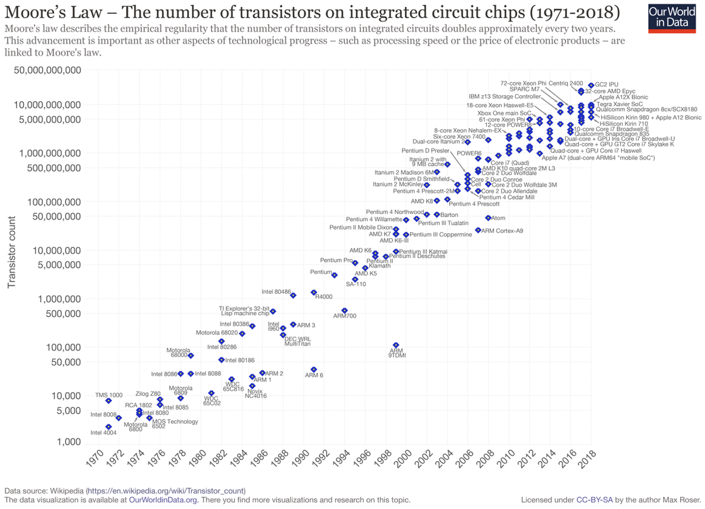
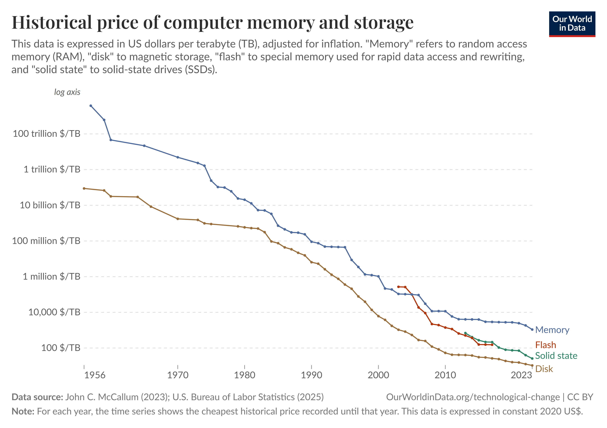
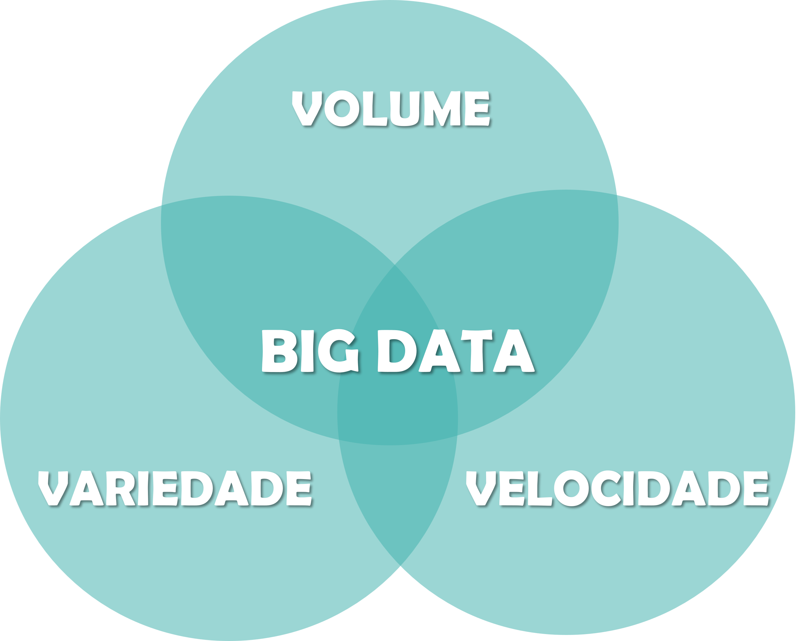
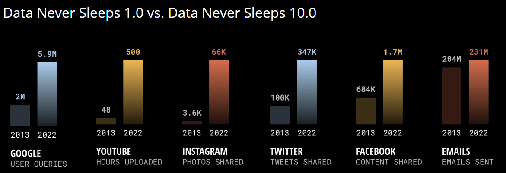
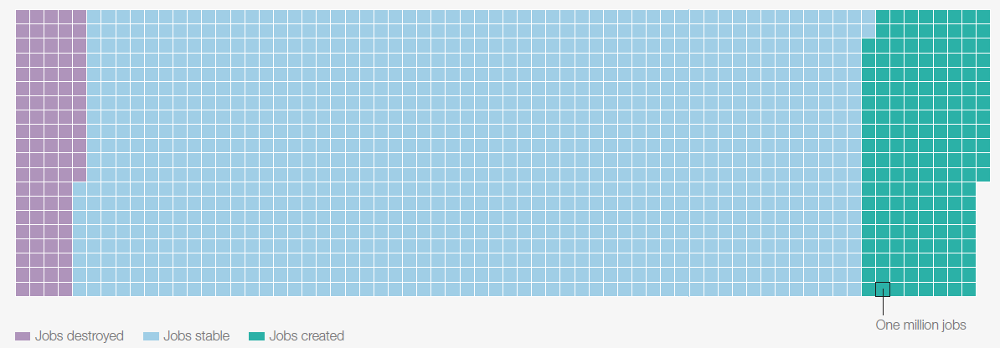
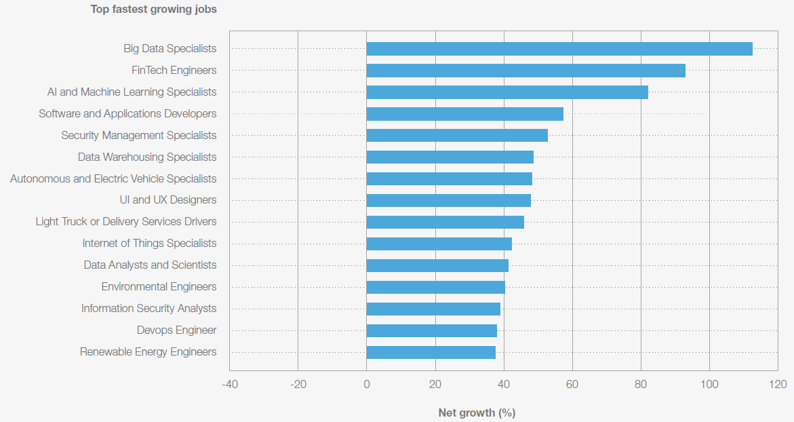
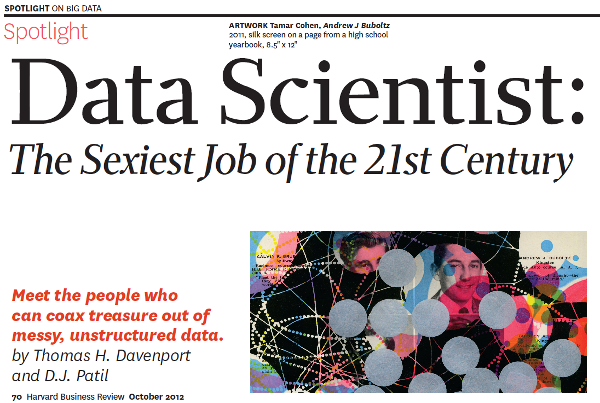
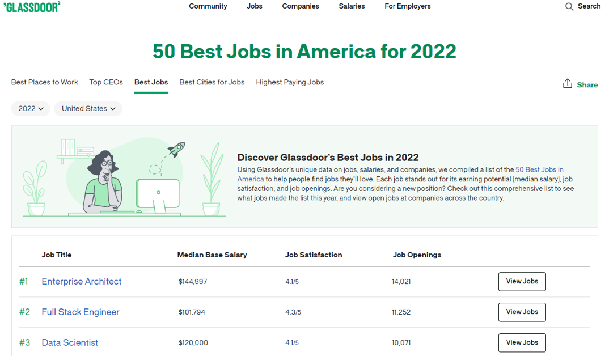

# Motivação {.unnumbered}

Em maio de 2017, a revista britânica *The Economist* estampou em sua capa uma provocação que sintetiza o espírito da era em que vivemos: **"The world's most valuable resource is no longer oil, but data"** (*O recurso mais valioso do mundo não é mais o petróleo, mas os dados*).

<!-- IMAGEM: Capa da The Economist "The world's most valuable resource" (slide 2) -->

](img/00-motivacao/0-1-the_economist_most_valuable_resource.png){#fig-economist}

A analogia é poderosa. Assim como o petróleo moldou a geopolítica e a economia do século XX, os dados estão redesenhando as relações de poder no século XXI. Não é por acaso que as maiores empresas do mundo [em valor de mercado](https://companiesmarketcap.com/) são justamente aquelas que extraem valor dos incontáveis rastros digitais gerados a cada segundo. Essa transformação traz consigo implicações profundas para o mercado de trabalho, criando novas carreiras, redefinindo competências e abrindo oportunidades sem precedentes para quem souber coletar, organizar, analisar e comunicar dados de forma eficaz.

Este capítulo percorre esse cenário em três etapas. Primeiro, faremos um **passeio histórico** que acredito que explique substancialmente como chegamos até o atual estado de coisas, revisitando saltos tecnológicos e mudanças sociais que tornaram possível essa nova *era dos dados*. Em seguida, discutimos o conceito de ***Big Data***, o fenômeno resultante desses avanços e as oportunidades quase que ilimitadas decorrentes desse processo. Na terceira parte, olhamos para o **mercado de trabalho nas carreiras de dados**, destacando os aspectos que consagraram a profissão de Cientista de Dados como uma das mais promissoras do nosso tempo.

## 4 razões de por que chegamos até aqui

### Processamento de dados: das válvulas aos bilhões de transistores

De forma simplificada, um computador é uma máquina que recebe **dados** de entrada, realiza operações lógicas e aritméticas sobre eles e devolve resultados. Os primeiros computadores eletrônicos de uso geral utilizavam **válvulas termiônicas** (componentes do tamanho de uma lâmpada) como "interruptores" para representar os dígitos binários (0 e 1) que sustentam toda a computação moderna.

O exemplo mais emblemático é o [**ENIAC**](https://www.britannica.com/technology/ENIAC) (*Electronic Numerical Integrator and Computer*), construído na Universidade da Pensilvânia entre 1943 e 1946. Projetado para calcular tabelas balísticas durante a Segunda Guerra Mundial, o ENIAC ocupava uma sala de aproximadamente 140 m², pesava cerca de 30 toneladas e consumia 150 kW de energia. Seu "cérebro" era composto por **17.468 válvulas**, além de milhares de resistores, capacitores e relês, totalizando cerca de 5 milhões de conexões soldadas à mão. Com tudo isso, ele era capaz de realizar aproximadamente **5.000 operações de adição por segundo**.

<!-- IMAGEM: Foto do ENIAC -->
{#fig-eniac width="75%"}

Apesar de impressionante para a época, o grande salto na computação veio com a invenção do **transistor** em 1947, nos Laboratórios Bell, e posteriormente com o desenvolvimento dos **circuitos integrados** no final dos anos 1950. Um transistor cumpre a mesma função de "interruptor eletrônico" que uma válvula, porém é incomparavelmente menor, mais rápido e mais barato. Quanto mais transistores conseguimos colocar em um único *chip*, mais operações ele pode realizar simultaneamente, e mais poderoso se torna o computador.

](img/00-motivacao/0-3-circuito_integrado.jpg){#fig-circuit .float-right-sm}

Em 1965, [Gordon Moore](https://en.wikipedia.org/wiki/Gordon_Moore), um dos fundadores da Intel Corporation, publicou um artigo na revista *Electronics* intitulado [*"Cramming more components onto integrated circuits"*](https://hasler.ece.gatech.edu/Published_papers/Technology_overview/gordon_moore_1965_article.pdf), no qual observou que o número de transistores em um circuito integrado vinha dobrando a cada ano desde 1959. Moore projetou que esse ritmo se manteria por pelo menos mais uma década. Em 1975, ele revisou a previsão para uma duplicação a cada **dois anos**, padrão que se manteve notavelmente estável por mais de cinco décadas, até os dias de hoje.

O que essa regularidade significa na prática? Enquanto em 1960 trabalhávamos com circuitos com algumas dezenas de componentes, um processador comercial moderno (como o GB202 da NVIDIA, lançado em 2024) possui mais de **92 bilhões de transistores**. Essa escalada sem precedentes na capacidade de processamento é o primeiro ingrediente que tornou possível lidar com volumes de dados antes inimagináveis.

{#fig-moore}

Para se ter uma ideia, o ENIAC de 1946 alcançava cerca de 500 [FLOPS](https://pt.wikipedia.org/wiki/FLOPS) (operações de ponto flutuante por segundo). Algumas décadas mais tarde, o supercomputador [Cray-1](https://en.wikipedia.org/wiki/Cray-1), referência nos anos 1970, atingia 160 milhões de FLOPS, e ocupava uma sala inteira. Hoje, um *smartphone* comum carrega no bolso um processador capaz de realizar **trilhões de operações por segundo** (teraFLOPS). O chip A17 Pro da Apple, por exemplo, alcança mais de 5 teraFLOPS, cerca de **10 bilhões de vezes** a capacidade do ENIAC, em um dispositivo que pesa pouco mais de 200 gramas.

### Transmissão de dados: dos cabos de cobre ao 5G

Um computador isolado, por mais poderoso que seja, tem utilidade limitada. O verdadeiro salto ocorre quando computadores se conectam, permitindo o fluxo de dados entre organizações, objetos e pessoas. Nesse sentido, a capacidade de transmitir dados entre máquinas distintas transformou dispositivos individuais em nós de uma rede global, expandindo significativamente o valor da computação. Sem transmissão eficiente de dados, não haveria Internet, comércio eletrônico, redes sociais, *streaming* de vídeo, computação em nuvem nem a economia digital como a conhecemos. Felizmente, as tecnologias de telecomunicação também avançaram expressivamente ao longo desse período.

](img/00-motivacao/0-5-fibra_optica.jpg){#fig-fibra .float-right-sm}

Considerando a transmissão **cabeada**, durante décadas as redes dependeram de **cabos de cobre** para transmitirem dados por meio de sinais elétricos. O problema é que esses sinais sofrem interferência eletromagnética, limitando a distância e a velocidade que se pode transmitir informações. A grande revolução veio com a **fibra óptica**: filamentos de vidro ultrapuro, mais finos que um fio de cabelo, que transmitem informação na forma de **pulsos de luz**. Como a luz viaja a cerca de 200.000 km/s dentro da fibra e é imune a interferências eletromagnéticas, as fibras ópticas permitem transmitir volumes de dados incomparavelmente maiores, a distâncias muito mais longas. A @tbl-evolucao-fibra ilustra essa [evolução impressionante](https://www.cablinginstall.com/cable/article/14211442/evolution-of-fiber-optic-transmission-a-history-of-performance-improvements): em menos de 50 anos, a capacidade de transmissão em uma única fibra saltou de **45 Mbps para 402 Tbps**, um aumento de quase **10 milhões de vezes**. Hoje, aproximadamente [99% de todo o tráfego internacional de dados](https://blog.telegeography.com/2023-mythbusting-part-3) passa por **cabos submarinos** de fibra óptica, que totalizam mais de 1,5 milhão de quilômetros no fundo dos oceanos.

| Período | Marco tecnológico | Velocidade |
|---------|-------------------|------------|
| 1956 | [TAT-1](https://en.wikipedia.org/wiki/TAT-1): primeiro cabo submarino de telefone (cobre coaxial) | ~0,5 Mbps |
| 1977 | Primeiros sistemas comerciais de fibra (LED + fibra multimodo) | 45-90 Mbps |
| 1988 | [TAT-8](https://ethw.org/Milestones:Trans-Atlantic_Telephone_Fiber-Optic_Submarine_Cable_(TAT-8),_1988): primeiro cabo submarino de fibra óptica | 280 Mbps |
| Anos 1990 | Amplificadores ópticos (EDFA) e multiplexação WDM | 2,5-10 Gbps |
| 1999 | Sistemas WDM com 100+ canais | 3,2 Tbps |
| 2024 | [Recorde NICT](https://www.nict.go.jp/en/press/2024/06/26-1.html): 6 bandas de comprimento de onda | 402 Tbps |

: Evolução da velocidade de transmissão em fibra óptica. {#tbl-evolucao-fibra}

É importante salientar que a transmissão de dados **sem fio** também evoluiu de forma igualmente impressionante. Baseada na propagação de **ondas eletromagnéticas**, essa tecnologia libertou as comunicações dos cabos físicos causando uma outra revolução nas telecomunicações. A @tbl-geracoes-movel resume a [evolução das gerações de tecnologia móvel](https://www.itu.int/en/ITU-R/study-groups/rsg5/rwp5d/imt-2020/Pages/default.aspx): a cada nova geração, observamos tanto aumentos expressivos de velocidade quanto redução da **latência** (atraso na transmissão), viabilizando aplicações que necessitam de transmissão de informações em tempo real como veículos autônomos.

| Geração | Período | Velocidade de pico | Avanço principal |
|---------|---------|-------------------|------------------|
| **2G** (GSM) | anos 1990 | ~0,1 Mbps | Digitalização: dados e SMS |
| **3G** (UMTS/HSPA) | anos 2000 | 2-42 Mbps | Internet móvel e e-mail |
| **4G** (LTE) | anos 2010 | 100 Mbps - 3 Gbps | Streaming de vídeo em tempo real |
| **5G** (NR) | anos 2020 | até 10 Gbps | "Internet das Coisas" massiva e latência ultrabaixa |

: Gerações de tecnologia móvel e suas velocidades de pico. Fonte: padrões IMT da ITU e especificações 3GPP. {#tbl-geracoes-movel}

Outras inovações, embora não sejam tecnologias físicas, também foram fundamentais para viabilizar a transmissão de dados em escala global. Nesse sentido, pode-se mencionar a [digitalização](https://en.wikipedia.org/wiki/Digitization) da informação (conversão de sinais analógicos em bits), os protocolos de rede como o [TCP/IP](https://en.wikipedia.org/wiki/Internet_protocol_suite) (que padronizou a comunicação entre computadores e deu origem à Internet) e os algoritmos de [compressão de dados](https://en.wikipedia.org/wiki/Data_compression) (como MP3, JPEG e H.264, que reduziram drasticamente o tamanho de arquivos multimídia).

### Armazenamento de dados: do armário de uma tonelada à *nuvem*

Processamento e transmissão não resume tudo que acontece ao longo da "vida" de um dado. Aliás, em boa parte do tempo, ele só precisa estar *estocado* em algum local. É nesse momento que entram as tecnologias de **armazenamento de dados**, cuja evolução foi tão impressionante quanto as demais.

{#fig-ramac .float-right-md}

Antes dos discos, os primeiros computadores armazenavam dados em **fitas magnéticas** e **tambores rotativos**, tecnologias lentas e de acesso sequencial. O grande salto veio com o [**IBM 305 RAMAC**](https://www.ibm.com/history/ramac), lançado em 1956: o primeiro **disco rígido** (*Hard Disk Drive* - HDD) comercial da história. Ele armazenava **3,75 MB** em 50 discos magnéticos de 24 polegadas, pesava cerca de uma tonelada e custava aproximadamente **US\$ 10.000 por megabyte**. Mas essa era apenas a primeira geração de uma tecnologia que não pararia de encolher e ganhar capacidade.

Nas décadas seguintes, os HDDs passaram por uma miniaturização impressionante: dos 50 discos de 24 polegadas do RAMAC, a indústria convergiu para o formato de **3,5 polegadas** que se tornaria padrão nos computadores pessoais. Ao mesmo tempo, a capacidade cresceu exponencialmente: o primeiro HDD de **1 GB** surgiu em 1980 (o [IBM 3380](https://www.ibm.com/history/3380-direct-access-storage), do tamanho de um refrigerador), o primeiro de **1 TB** chegou ao mercado em 2007 (já no formato compacto de 3,5"), e hoje existem HDDs comerciais com mais de **20 TB**. Durante mais de 50 anos, os discos rígidos foram a tecnologia dominante de armazenamento digital.

Paralelamente aos HDDs, surgiram as **mídias removíveis**, que trouxeram portabilidade ao armazenamento. Os **disquetes** (*floppy disks*), populares entre os anos 1970 e 1990, foram os primeiros dispositivos que permitiam carregar e trocar arquivos entre computadores, embora com capacidade limitada a **1,44 MB**. As **mídias ópticas** vieram em seguida: o **CD** (1982, 700 MB) e o **DVD** (1996, 4,7 GB) revolucionaram a distribuição de *software*, música e filmes. Finalmente, no início dos anos 2000, os **pendrives** (*USB flash drives*) popularizaram a **memória flash**, uma tecnologia baseada em chips semicondutores capaz de armazenar dados sem partes mecânicas. Com os pendrives, gigabytes de dados passaram a caber literalmente no bolso.

Uma segunda revolução ocorreu com os **drives de estado sólido** (*Solid State Drives* - SSDs). Diferentemente dos HDDs, que dependem de discos magnéticos giratórios e cabeçotes mecânicos, os SSDs armazenam dados em **chips de memória flash**, sem partes móveis. O resultado: velocidades de leitura e escrita ordens de grandeza superiores, menor consumo de energia e maior resistência a impactos. O [primeiro SSD comercial para PCs](https://www.computerhistory.org/storageengine/solid-state-drive-module-demonstrated/) foi lançado pela SanDisk em 1991, com 20 MB por US\$ 1.000. A popularização veio nos anos 2000, quando a Samsung introduziu SSDs com interface SATA (2006) e os preços começaram a cair. Hoje, SSDs de 1 TB custam menos de US\$ 50.

{#fig-custo-armazenamento .float-right-lg}

Segundo o [Our World in Data](https://ourworldindata.org/grapher/historical-cost-of-computer-memory-and-storage), o custo por gigabyte (Gb) de armazenamento caiu de mais de **US\$ 1 milhão nos anos 1950** para **menos de US\$ 0,02 atualmente**, uma redução de mais de 50 bilhões de vezes (veja a @fig-custo-armazenamento). Com armazenamento tão barato, a nova fronteira dessa evolução tecnológica são os **centros de dados** (*data centers*): instalações que reúnem milhares de servidores equipados com as mesmas tecnologias de armazenamento (HDDs, SSDs e até fitas magnéticas para backup), organizadas em [camadas conforme a frequência de acesso](https://blog.westerndigital.com/long-term-case-for-hdd-storage/) aos dados. A partir dos anos 2000, o modelo de [**computação em nuvem**](https://aws.amazon.com/what-is-cloud-computing/) (*cloud computing*) transformou esses *data centers* em serviços acessíveis a qualquer pessoa, com diversas empresas de tecnologia passando a oferecer capacidade de armazenamento e processamento sob demanda, eliminando a necessidade de manter servidores próprios. 

### O mundo na palma da mão: pessoas e objetos, tudo conectado

Por fim, é importante destacar que os avanços em processamento, transmissão e armazenamento só se traduzem em "toneladas de dados" porque foram acompanhados por dois fenômenos complementares: uma adoção sem precedentes de tecnologias digitais pela população mundial e uma capacidade crescente de medir e registrar os mais diversos atributos do mundo físico (natural e artificial) à nossa volta. 

Do lado das pessoas, o que impressiona não é apenas o número de usuários, mas a **velocidade** com que cada nova tecnologia foi adotada. A @fig-adocao mostra a evolução da adoção de algumas tecnologias de comunicação nos EUA. Consideremos o período necessário para uma tecnologia avançar de 20% para 80% da populaçã utilizando-a. Entre os dispositivos, esse intervalo foi de 45 anos (1907–1962) para o telefone fixo (*landline*), mas de apenas 12 anos (1997–2009) para o telefone celular (*cellular phone*), quase quatro vezes menor. Já entre os tipos de serviços tecnológicos, a Internet levou 15 anos (1997–2012) para percorrer esse mesmo caminho, enquanto o uso de mídias sociais (por exemplo, Instagram, Facebook e TikTok) levou 9 anos (2008–2017).

](img/00-motivacao/0-8-adocao-tech-usa.png){#fig-adocao width="80%"}

Do lado dos objetos, o barateamento dos sensores e a expansão das redes de comunicação permitiram que bilhões de dispositivos físicos passassem a coletar e transmitir informações de forma contínua e autônoma. É o que se convencionou chamar de [**Internet das Coisas**](https://en.wikipedia.org/wiki/Internet_of_things) (*Internet of Things* - IoT): termômetros, acelerômetros, câmeras, medidores de energia, sensores de tráfego, estações meteorológicas e dispositivos vestíveis (*wearables*), todos conectados e gerando fluxos ininterruptos de dados. Segundo a [Statista](https://www.statista.com/statistics/1183457/iot-connected-devices-worldwide/), o número de dispositivos IoT conectados no mundo saltou de cerca de 8 bilhões em 2019 para mais de 18 bilhões em 2024, com projeção de ultrapassar 39 bilhões até 2033. Em transportes, por exemplo, sensores embarcados em veículos, laços indutivos em vias, radares e câmeras de monitoramento produzem terabytes de dados diariamente sobre fluxo, velocidade, ocupação e condições de tráfego.

## Big Data

A convergência desses quatro fatores criou as condições para o fenômeno que atualmente chamamos de *Big Data*. É importante salientar que o termo não se refere apenas à existência de um **volume** muito grande de dados. Ele descreve um cenário em que a **velocidade** com que são produzidos e a **variedade** com que podem ser encontrados também geram enormes desafios para a sua coleta, armazenamento e análise. Estes são os **3 V's** que caracterizam o *Big Data*:

{#fig-3V-BigData width="75%"}

Para ter uma intuição da rapidez com que os dados vêm sendo produzidos, uma iniciativa bastante interessante chamada [Data Never Sleeps](https://www.domo.com/data-never-sleeps) (*dados nunca dormem*) tem registrado o volume de conteúdo produzido a cada minuto por diversos serviços de Internet ao longo dos anos. Observe na @fig-data_never_sleeps que, em apenas 10 anos, o número de horas de vídeo enviadas ao YouTube por minuto saltou de 48 para 500, enquanto o número de fotos compartilhadas no Instagram aumentou de 3,6 mil para 66 mil. Esse ritmo significa que o mundo produz cerca de [400 Exabytes diariamente](https://explodingtopics.com/blog/data-generated-per-day), conforme estimativas da [Statista para 2025](https://www.statista.com/statistics/871513/worldwide-data-created/). Para colocar em perspectiva, isso equivale a aproximadamente 400 milhões de discos rígidos de 1 terabyte apenas para armazenar o que é gerado em um único dia.

{#fig-data_never_sleeps}

No contexto das tecnologias de transportes, um fato bastante interessante é o quanto veículos autônomos dependem de dados para avaliar as condições atuais e tomar decisões em tempo real. A partir da combinação de sensores como câmeras, radar e LiDAR, estima-se que um único veículo possa gerar cerca de [10 GB de dados por segundo](https://semiconductor.samsung.com/news-events/tech-blog/autonomous-driving-and-the-modern-data-center/). Esse ritmo significa esgotar o equivalente a 40 discos rígidos de 1 TB em apenas uma hora. São números nos permitem contemplar, inclusive, o desafio que será a gestão desses dados em *data centers* caso a tecnologia se difunda rapidamente como aquelas de comunicação que discutimos anteriormente (@fig-adocao).

{#fig-aut_veic width="75%"}

Do ponto de vista da variedade, durante boa parte do século XX, os dados com os quais pesquisadores e organizações trabalhavam eram predominantemente **estruturados**: números e categorias organizados em tabelas com linhas e colunas bem definidas, como planilhas, formulários de pesquisa e bancos de dados relacionais. Esse formato tabular era (e continua sendo) a base da análise estatística clássica que veremos neste livro.

Todavia, o cenário mudou radicalmente com a popularização da Internet, dos smartphones e dos sensores. Hoje, a maior parte dos dados gerados no mundo não cabe em uma tabela. Cerca de [80% dos dados globais são *não estruturados*](https://mitsloan.mit.edu/ideas-made-to-matter/tapping-power-unstructured-data), isto é, não possuem um esquema fixo de linhas e colunas. São, por exemplo, **textos livres** (e-mails, artigos, publicações em redes sociais), **imagens** (fotos de satélite, radiografias, imagens de câmeras de tráfego), **vídeos** (gravações de segurança, transmissões ao vivo) e **áudios** (chamadas telefônicas, podcasts, gravações de sensores acústicos). Além desses, existe uma categoria intermediária, os **dados semiestruturados**, que possuem alguma organização, mas sem um esquema rígido, como arquivos JSON, XML, logs de servidores e dados de sensores IoT.

{#fig-nao_estruturados}

A capacidade de coletar, armazenar e extrair conhecimento dessa variedade de formatos é um dos grandes desafios (e oportunidades) da era dos dados. Não por acaso, boa parte dos avanços recentes em Inteligência Artificial, como modelos de linguagem e visão computacional, surgiu justamente da necessidade de processar esses dados não estruturados em larga escala. Naturalmente, toda essa transformação tem reflexos diretos no mercado de trabalho e nas competências profissionais mais valorizadas, que veremos com mais detalhe logo mais.

## O Mercado de Trabalho nas *Carreiras de Dados*

A explosão na geração de dados vem abrindo espaço para ganhos expressivos de eficiência e inovação nas organizações, além de viabilizar novos produtos, serviços e mercados. Consequentemente, há uma demanda crescente por profissionais capazes de transformar dados brutos em informação útil e conhecimento acionável para apoiar decisões. Nesta seção, apresentamos o que se entende por *carreiras de dados*, com foco na atuação em **Ciência de Dados**. Para isso, começamos apresentando um panorama global do mercado de trabalho para os próximos anos. Na sequência, contextualizamos a origem e consolidação da carreira de Cientista de Dados e encerramos com perspectivas sobre capacitação nesta área.

### O *Future of Jobs Report* (2025)
Para termos um panorama amplo sobre esse tema, vale olhar para alguns achados do [*Future of Jobs Report*](https://www.weforum.org/publications/series/future-of-jobs/), uma publicação realizada a cada 2 anos que sintetiza tendências do mercado de trabalho a partir da visão de empregadores produzida pelo [Fórum Econômico Mundial](https://www.weforum.org/). Na edição de [2025]((https://www.weforum.org/publications/the-future-of-jobs-report-2025/)), o relatório reuniu respostas de mais de 1.000 empresas, que juntas representam mais de 14 milhões de trabalhadores, em 22 setores e 55 países ao redor do mundo.

Um primeiro questionamento importante diz respeito às principais tendências de transformação dos negócios para os próximos anos. Nesse sentido, 60% dos empregadores apontaram a ampliação do acesso digital (@fig-adocao, ela, de novo!) como um fator central, seguida por questões relacionadas ao custo de vida (50%) e por esforços para a diminuição de emissões de carbono (47%). Já entre os tipos de tecnologia que impactarão seus negócios nos próximos anos, 86% indicam que Inteligência Artificial (IA) e tecnologias de processamento de informação serão determinantes, seguidas por robôs e automação de sistemas (58%) e por geração, armazenamento e distribuição de energia (41%).

Levando em consideração os principais conjuntos de tendências levantadas, estima-se que, até 2030, serão criados 170 milhões novos postos de trabalho (14% dos 1,4 bilhões de empregos da base analisada). Ao mesmo tempo, projeta-se a extinção de 92 milhões de empregos no mesmo período (8% do total). O saldo, ainda assim, é positivo: um aumento líquido de 78 milhões de ocupações nos próximos anos, conforme a @fig-criacao_destruicao_empregos_fojr.

{#fig-criacao_destruicao_empregos_fojr}

Ao observar a natureza dessa oferta de trabalho adicional (@fig-jobs_created), percebe-se com clareza a relevância das *carreiras em dados*. Note o crescimento líquido em ocupações como **especialistas em *Big Data* ** (mais de 100%), **especialistas em IA e Aprendizado de Máquina** (cerca de 80%) e **analistas e cientistas de dados** (pouco mais de 40%). Em grande medida, esses rótulos nomeiam variações de um mesmo núcleo: todas são carreiras centradas em coletar, organizar, analisar e modelar dados para gerar valor.

{#fig-jobs_created}

O que muda, em geral, é o foco da aplicação e a ênfase técnica de cada uma, seja na infraestrutura e escala (*Big Data*), no desenvolvimento de modelos e automação (IA e Aprendizado de Máquina), ou na análise e tomada de decisão orientada por dados como uma atuação mais "ponta a ponta", conectando o problema, os dados, a análise e a entrega de valor (Ciência de Dados). Perceba que esta última engloba de forma mais abrangente um roteiro de análise de dados. Sendo assim, vale a pena discutirmos de forma mais contextualizada esta carreira que é o foco deste livro.

### A carreira em Ciência de Dados

O termo “cientista de dados” foi cunhado em 2008, quando [D.J. Patil](https://en.wikipedia.org/wiki/DJ_Patil) e [Jeff Hammberbacher](https://en.wikipedia.org/wiki/Jeff_Hammerbacher) passaram a utilizá-lo para descrever um novo tipo de profissional, em uma época em que a versão inaugural do iPhone ainda alcançava seus primeiros usuários. Pouco tempo depois, D.J. Patil ajudou a popularizar a expressão ao assinar o artigo [*Data Scientist: The Sexiest Job of the 21st Century*](https://hbr.org/2012/10/data-scientist-the-sexiest-job-of-the-21st-century) na *Harvard Business Review* em coatoria com [Thomas H. Davenport](https://en.wikipedia.org/wiki/Thomas_H._Davenport). Esta matéria viria a se tornar uma grande referência a respeito do tema (@fig-sexiest_job), chamando a atenção por explicitar o que esse(a) profissional seria capaz de fazer, quais as competências esperadas e por que organizações teriam dificuldade para recrutá-lo(a). Como curiosidade, naquela época Patil atuava na área de produtos de dados do LinkedIn, e mais tarde se tornaria o primeiro *Chief Data Scientist* da Casa Branca, em 2015.

{#fig-sexiest_job}

Um ponto especialmente interessante do texto é a descrição da Ciência de Dados menos como conjunto de atribuições e mais como um modo de atuar dentro das organizações. Nesse sentido, trata-se de um perfil híbrido, capaz de dar forma a dados desorganizados, conectar fontes imperfeitas, comunicar achados de maneira convincente e orientar decisões em produtos e processos. Ao mesmo tempo, são profissionais que tendem a buscar autonomia para experimentar e, sobretudo, proximidade com o “lugar onde as decisões acontecem”, isto é, com equipes de produto e operação, porque preferem construir soluções que gerem impacto concreto em vez de apenas entregar recomendações.

O texto trazia ainda uma ênfase importante na escassez de formações acadêmicas específicas para a área, a partir da qual Patil e Davenport sugeriram que recrutadores buscassem trajetórias alternativas para identificar e desenvolver esse perfil. A demanda crescente nos anos seguintes acelerou a criação de caminhos de formação, e uma década depois já se observava uma transformação profunda nesse cenário. Atualmente, são abundantes os cursos sobre Ciência de Dados em diferentes formatos e níveis, desde extensão, graduação, especialização, MBA, mestrado e doutorado.

O que aconteceu com a carreira de Cientista de Dados desde esta publicação emblemática é história. Em poucos anos, a profissão passou a figurar de forma recorrente nos principais *rankings* internacionais de melhores carreiras. A convergência de fontes tão distintas, de plataformas de emprego a agências governamentais, deixa pouco espaço para dúvida quanto à consolidação dessa profissão.

A plataforma [Glassdoor](https://www.glassdoor.com/), uma das principais referências em avaliação de empregos, elegeu "Cientista de Dados" como a **melhor profissão dos Estados Unidos por quatro anos consecutivos** (2016 a 2019) em seu ranking anual *50 Best Jobs in America*. Nos anos seguintes, a profissão se manteve entre as três primeiras colocadas (3º em 2020, 2º em 2021 e 3º em 2022), consolidando ao menos **sete anos consecutivos no pódio**. Este *ranking* avalia as profissões com base em três critérios ponderados igualmente: **potencial de remuneração** (salário-base mediano anual), **satisfação no trabalho** (avaliação dos próprios profissionais) e **número de vagas abertas** na plataforma. No caso de Cientista de Dados, os números eram consistentemente expressivos, com salário-base mediano entre US\$ 110 e 120 mil anuais, nota de satisfação acima de 4,0 (em uma escala até 5) e milhares de vagas em aberto.

{#fig-glasdoor_best_jobs}

O [*U.S. News & World Report*](https://money.usnews.com/careers/best-jobs/data-scientist), outra referência tradicional em rankings de carreiras nos EUA, também passou a incluir Cientista de Dados entre as melhores profissões em sua lista anual *100 Best Jobs*, alcançando a 3ª posição em 2022. Os critérios do *U.S. News* incluem taxa de desemprego na profissão, crescimento projetado em dez anos, perspectivas do setor e nível de estresse.

Do ponto de vista institucional, os números do [*Bureau of Labor Statistics*](https://www.bls.gov/ooh/math/data-scientists.htm) (BLS), a agência oficial de estatísticas trabalhistas do governo dos EUA, confirmam essa tendência de forma inequívoca: a projeção mais recente estima um **crescimento de 34% no emprego de cientistas de dados entre 2024 e 2034**, tornando-a a **4ª ocupação com maior taxa de crescimento** no país, muito acima da média geral de apenas 3% para todas as profissões. 

Em 2022, dez anos após a publicação original, os próprios Patil e Davenport revisitaram o tema em um novo artigo na *Harvard Business Review* intitulado [*Is Data Scientist Still the Sexiest Job of the 21st Century?*](https://hbr.org/2022/07/is-data-scientist-still-the-sexiest-job-of-the-21st-century), no qual reafirmaram a relevância da profissão, reconhecendo que o campo havia se diversificado e amadurecido consideravelmente desde então.

### A capacitação em Ciência de Dados

Conhecido o sucesso da carreira em Ciência de Dados, uma curiosidade fica no ar: qual é a rotina, na prática, de um(a) cientista de dados? Uma visão bastante didática é apresentada em um dos livros mais influentes da área, o *R for Data Science* [@r4ds_pt_2e], cuja tradução para o português da 2ª edição já se encontra disponível gratuitamente [em formato online](https://pt.r4ds.hadley.nz/). Em vez de retratar Ciência de Dados como uma sequência linear de etapas, o livro propõe um fluxo de trabalho iterativo, no qual você avança e retorna entre fases conforme aprende mais sobre o problema e sobre os dados (@fig-ciclo_cdd).

Em termos gerais, o ciclo começa quando os dados são **importados** para o ambiente de trabalho e então **organizados** em uma estrutura que permita e facilite a análise. A partir daí, entra a fase de **transformação**, em que você filtra, cria variáveis, corrige inconsistências e prepara a base para responder perguntas. Em seguida, a **visualização** ajuda a explorar padrões e levantar hipóteses, que podem ser aprofundadas com **modelagem**, quando faz sentido estimar relações, prever resultados ou explicar mecanismos. Por fim, nenhuma análise se completa sem **comunicação**, isto é, transformar resultados em narrativa, gráficos e recomendações compreensíveis para outras pessoas. Ao longo de todo o processo, a prática de programação funciona como um suporte transversal que garante reprodutibilidade, organização e eficiência, além de viabilizar a **automação** de tarefas e análises recorrentes, de modo que o ciclo possa se repetir com muito mais agilidade à medida que novas perguntas surgem ou os dados mudam.

{#fig-ciclo_cdd .float-right-lg}

Um aspecto particularmente interessante deste livro é a ênfase em etapas do ciclo que, em geral, recebem pouca atenção em livros-texto tradicionais de Estatística, como importação, organização, transformação e visualização de dados. Entretanto, são competências fundamentais para dar concretude a ideias estatísticas e probabilísticas básicas, pois é nelas que aprendemos a reconhecer padrões, formular perguntas, checar suposições e interpretar medidas e gráficos com senso crítico.

Agora que entendemos um pouco da rotina de trabalho de um(a) cientista de dados, a próxima pergunta a ser respondida é: quais as habilidades necessárias para desempenhar bem este papel? Para respondê-la, uma representação bastante utilizada nos cursos de formação na área é o diagrama de Venn da @fig-dominios_cdd, que ilustra três grandes domínios de competência que, combinados, definem o perfil do(a) cientista de dados. Nenhum deles é, isoladamente, suficiente: é na interseção dos três que reside o diferencial dessa carreira.

{#fig-dominios_cdd  .float-left-md}

O **domínio matemático e estatístico** fornece a base teórica para toda análise de dados. Ele abrange fundamentos de **Probabilidade e Estatística** (que sustentam a inferência, a quantificação de incerteza e a tomada de decisão sob variabilidade), **Cálculo** (necessário para entender otimização e convergência de algoritmos) e **Álgebra Linear** (essenciais para compreender transformações, decomposições e representações matriciais de dados em modelos mais avançados). A partir dessas bases, é possível ganhar autonomia na formulação de **modelos estatísticos clássicos** (ex.: Regressão, Análise de Variância e Séries Temporais) e de **Aprendizado de Máquina** (ex.: Árvores de Decisão e Redes Neurais), que permite ao(à) profissional ir além da mera descrição dos dados e formular conclusões com rigor.

O **domínio ferramental** reúne as habilidades técnicas e computacionais que viabilizam a execução prática do ciclo de Ciência de Dados. As **linguagens de programação** ocupam posição central, com destaque para R, Python e Julia, bastante utilizadas na área. Enquanto R se destaca pela riqueza do ecossistema estatístico e de visualização (e será a linguagem adotada neste livro), Python é amplamente adotado em Aprendizado de Máquina e Engenharia de Dados e Julia vem ganhando espaço em aplicações que exigem alto desempenho computacional. Além das linguagens, esse domínio inclui o conhecimento em **bancos de dados** relacionais (SQL) e não relacionais (NoSQL), ***frameworks* para processamento de grandes volumes de dados** (como Apache Spark e Hadoop), ferramentas de **versionamento de código** (Git), ambientes de **computação em nuvem** e **plataformas de visualização e comunicação** de resultados.

O **domínio da área de aplicação** é o que confere propósito e contexto à análise. Um dos aspectos mais marcantes da Ciência de Dados é a sua **transversalidade**: existem profissionais atuando em praticamente todos os setores da economia, da saúde ao varejo, das finanças à agricultura, da indústria ao setor público. Por isso, além de dominar técnicas e ferramentas, é preciso compreender profundamente o problema que se pretende resolver e o contexto em que os dados foram gerados. Na área de **Transportes**, por exemplo, isso significa entender conceitos em **Engenharia de Tráfego, Planejamento e Operação de Transporte Público, Comportamento Individual relativo a Viagens, Segurança Viária, Logística e Cadeia de Suprimentos**, entre outros. É esse conhecimento setorial que permite formular as perguntas certas, interpretar resultados de forma crítica e propor soluções que façam sentido na prática.

Com este panorama em mente, esta obra pretende desenvolver fundamentos matemáticos e estatísticos basilares (domínio teórico) por meio de ferramentas computacionais modernas (domínio ferramental), sempre que possível contextualizados em problemas reais de Engenharia de Transportes (domínio de aplicação). A ideia é que teoria e prática caminhem lado a lado desde o início, de modo que cada conceito novo ganhe concretude imediata através de código, dados e visualizações.

## Recapitulando

Neste capítulo, percorremos um longo caminho para entender por que os dados se tornaram tão centrais no mundo contemporâneo. Vimos que quatro grandes forças convergiram para isso: o crescimento exponencial na capacidade de **processamento** , os avanços na **transmissão** de dados, a revolução no **armazenamento** e a **conectividade massiva** de pessoas e objetos à Internet. Juntos, esses saltos criaram as condições para o fenômeno do *Big Data*, caracterizado pelo volume, variedade e velocidade dos dados gerados continuamente ao redor do planeta.

Em seguida, olhamos para os reflexos dessa transformação no mercado de trabalho. O *Future of Jobs Report* de 2025 mostrou que as carreiras em dados estão entre as que mais crescem no mundo, e a profissão de Cientista de Dados se consolidou como uma das mais promissoras do século, com reconhecimento em diversos *rankings*. Por fim, discutimos o que significa se capacitar nessa área: um fluxo de trabalho iterativo que vai da importação à comunicação dos dados, sustentado por três domínios de competência (matemático/estatístico, ferramental e de aplicação) que se complementam e se reforçam mutuamente.

Agora que o cenário está posto, é hora de começar a construir essas competências na prática. E o primeiro passo é dominar a ferramenta que nos acompanhará ao longo de todo o livro. No próximo capítulo, faremos uma **Introdução ao R**, a linguagem de programação que será o nosso principal instrumento de trabalho. Ter fluência nessa ferramenta é um diferencial importante para que os conceitos estatísticos e probabilísticos apresentados nas partes seguintes possam ser não apenas compreendidos, mas efetivamente aplicados, visualizados e experimentados. Em outras palavras, o domínio ferramental é o alicerce sobre o qual construiremos, passo a passo, o domínio teórico.
