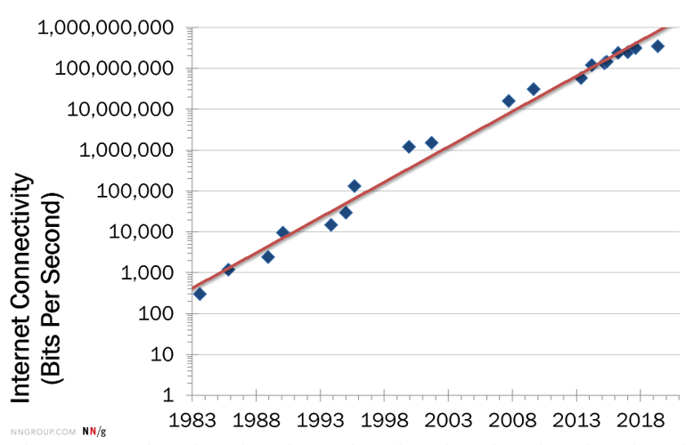
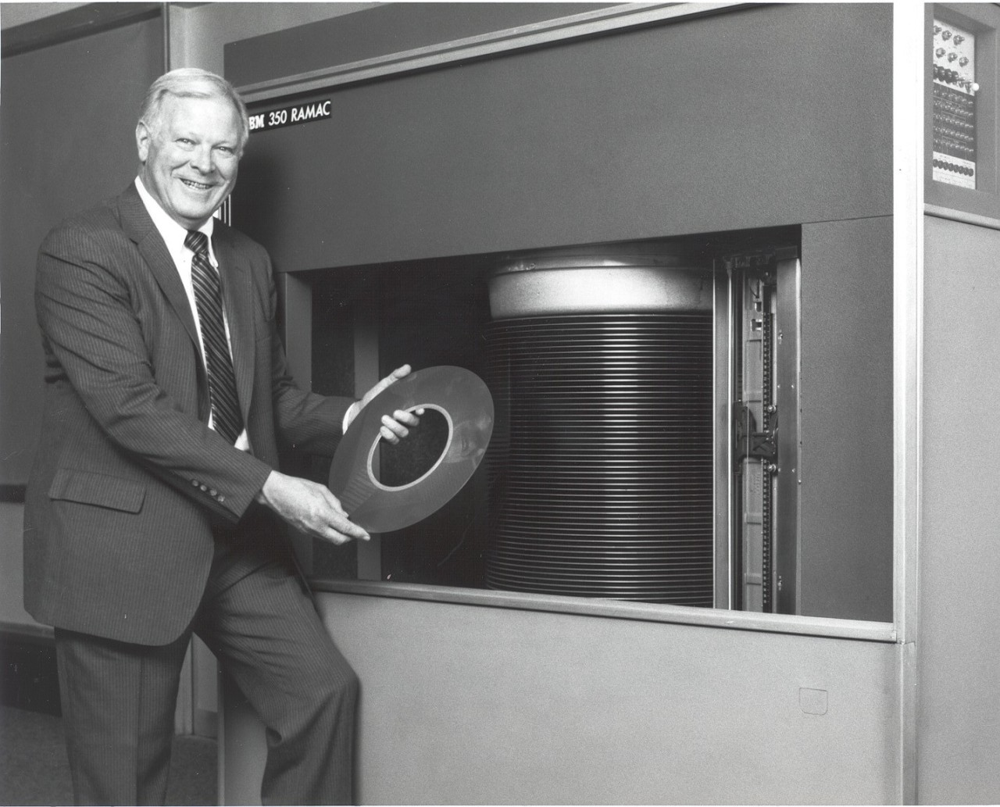

Em maio de 2017, a revista britânica *The Economist* estampou em sua capa uma provocação que sintetiza o espírito da era em que vivemos: **"The world's most valuable resource is no longer oil, but data"** (*O recurso mais valioso do mundo não é mais o petróleo, mas os dados*).

<!-- IMAGEM: Capa da The Economist "The world's most valuable resource" (slide 2) -->

](img/00-motivacao/0-1-the_economist_most_valuable_resource.png){#fig-economist}

A analogia é poderosa. Assim como o petróleo moldou a geopolítica e a economia do século XX, os dados estão redesenhando as relações de poder no século XXI. As maiores empresas do mundo em valor de mercado já não são petroleiras ou montadoras: são empresas de tecnologia cuja principal matéria-prima são os dados gerados por bilhões de usuários. Mas por que os dados se tornaram tão valiosos? Para responder a essa pergunta, vale a pena fazermos um breve passeio por alguns avanços tecnológicos das últimas décadas.

## Das válvulas aos bilhões de transistores: meio século de revoluções silenciosas

De forma simplificada, um computador é uma máquina que recebe **dados** de entrada, realiza operações lógicas e aritméticas sobre eles e devolve resultados. Os primeiros computadores eletrônicos de uso geral utilizavam **válvulas termiônicas** (componentes do tamanho de uma lâmpada) como "interruptores" para representar os dígitos binários (0 e 1) que sustentam toda a computação moderna.

O exemplo mais emblemático é o [**ENIAC**](https://www.britannica.com/technology/ENIAC) (*Electronic Numerical Integrator and Computer*), construído na Universidade da Pensilvânia entre 1943 e 1946. Projetado para calcular tabelas balísticas durante a Segunda Guerra Mundial, o ENIAC ocupava uma sala de aproximadamente 140 m², pesava cerca de 30 toneladas e consumia 150 kW de energia. Seu "cérebro" era composto por **17.468 válvulas**, além de milhares de resistores, capacitores e relês, totalizando cerca de 5 milhões de conexões soldadas à mão. Com tudo isso, ele era capaz de realizar aproximadamente **5.000 operações de adição por segundo**.

<!-- IMAGEM: Foto do ENIAC -->
{#fig-eniac}

O grande salto veio com a invenção do **transistor** em 1947 nos Laboratórios Bell, e posteriormente com o desenvolvimento dos **circuitos integrados** no final dos anos 1950. Um transistor cumpre a mesma função de "interruptor eletrônico" que uma válvula, porém é incomparavelmente menor, mais rápido, mais barato e mais eficiente em termos de energia. Quanto mais transistores conseguimos colocar em um único *chip*, mais operações ele pode realizar simultaneamente, e mais poderoso se torna o computador.

](img/00-motivacao/0-3-circuito_integrado.jpg){#fig-circuit}

### Processamento de dados: a Lei de Moore

Em 1965, [Gordon Moore](https://en.wikipedia.org/wiki/Gordon_Moore), cofundador da Intel Corporation, publicou um artigo na revista *Electronics* intitulado [*"Cramming more components onto integrated circuits"*](https://hasler.ece.gatech.edu/Published_papers/Technology_overview/gordon_moore_1965_article.pdf), no qual observou que o número de componentes em um circuito integrado vinha dobrando a cada ano desde 1959. Moore projetou que esse ritmo se manteria por pelo menos mais uma década. Em 1975, ele revisou a previsão para uma duplicação a cada **dois anos**, ritmo que se manteve notavelmente estável por mais de cinco décadas, até os dias de hoje.

{#fig-moore}

O que essa regularidade significa na prática? Enquanto em 1960 trabalhávamos com circuitos com algumas dezenas de componentes, um processador comercial moderno (como o GB202 da NVIDIA, lançado em 2024) possui mais de **92 bilhões de transistores**. Essa escalada exponencial na capacidade de processamento é o primeiro ingrediente que tornou possível lidar com volumes de dados antes inimagináveis.

Para se ter uma ideia, o ENIAC de 1946 alcançava cerca de 500 [FLOPS](https://pt.wikipedia.org/wiki/FLOPS) (operações de ponto flutuante por segundo). O supercomputador [Cray-1](https://en.wikipedia.org/wiki/Cray-1), referência nos anos 1970, atingia 160 milhões de FLOPS, e ocupava uma sala inteira. Hoje, um *smartphone* comum carrega no bolso um processador capaz de realizar **trilhões de operações por segundo** (teraFLOPS). O chip A17 Pro da Apple, por exemplo, alcança mais de 5 teraFLOPS, cerca de **10 bilhões de vezes** a capacidade do ENIAC, em um dispositivo que pesa pouco mais de 200 gramas.

### Transmissão de dados: a Lei de Nielsen e as gerações móveis

De nada adiantaria processar enormes volumes de dados se não fosse possível transmiti-los de forma eficiente e confiável entre diferentes computadores. Felizmente, as tecnologias de telecomunicação também avançaram significativamente ao longo desse período. Em 1998, Jakob Nielsen, um especialista em usabilidade e experiência do usuário (UX), documentou uma regularidade empírica que ficou conhecida como a [**Lei de Nielsen**](https://www.nngroup.com/articles/law-of-bandwidth/): a capacidade máxima de transferência de dados de uma rede ou conexão disponível para usuários domésticos (conhecida como largura de banda) aparentava crescer cerca de **50% ao ano**, equivalendo a uma duplicação a cada 21 meses aproximadamente. indicando uma aderência impressionante ao longo de quatro décadas, conforme o gráfico a seguir

{#fig-internet_connectivity}

Para as conexões móveis, a evolução foi igualmente expressiva, impulsionada pelas sucessivas gerações de tecnologia de radiofrequência. A tabela abaixo resume os marcos principais, com velocidades de pico definidas pelos padrões [IMT da União Internacional de Telecomunicações (ITU)](https://www.itu.int/en/ITU-R/study-groups/rsg5/rwp5d/imt-2020/Pages/default.aspx):

| Geração | Período aproximado | Velocidade de pico | Avanço principal |
|---------|-----------|-------------------|-------------------|---------|
| **2G** (GSM) | anos 1990 | ~0,1 Mbps | Dados digitais e SMS |
| **3G** (UMTS/HSPA) | anos 2000 | 2 Mbps (até 42 Mbps com HSPA+) | Internet móvel e e-mail |
| **4G** (LTE) | anos 2010 | 100 Mbps (até 3 Gbps com LTE-A Pro) | Streaming de vídeo em tempo real |
| **5G** (NR) | anos 2020 | até 10 Gbps | "Internet das Coisas" massiva e latência ultrabaixa |

: Gerações de tecnologia móvel e suas velocidades de pico. Fonte: padrões IMT da ITU e especificações 3GPP. {#tbl-geracoes_tec_movel}

A cada nova geração, não apenas a velocidade aumentou como também a **latência** (atraso na transmissão de dados através de uma rede móvel) diminuiu drasticamente, viabilizando aplicações em tempo real como veículos autônomos, telemedicina e cidades inteligentes.

### Armazenamento de dados: do armário de uma tonelada ao bolso

Processar e transmitir dados com rapidez é bacana, mas em algum momento os dados vão precisar *descansar* em algum *estoque*... Sobre esse aspecto, estamos lidando com as tecnologias de **armazenamento** de dados. E a evolução nesse campo foi tão impressionante quanto nas demais. 

É raro falar em armazenamento de dados hoje em dia utilizando grandeza inferior ao gigabyte. Mas acredite: o primeiro disco rígido comercial da história, o [**IBM 350**](https://www.ibm.com/history/ramac), lançado em 1956, armazenava **3,75 MB** em 50 discos magnéticos de 24 polegadas cada. Ele era do tamanho de dois refrigeradores, pesava cerca de uma tonelada e o custo de aluguel do sistema era de US\$ 3.200 por mês (cerca de US\$ 36.000 em valores atuais), o que equivalia a aproximadamente **US\$ 10.000 por megabyte**.

<!-- IMAGEM: Foto do IBM 350 RAMAC -->
{#fig-ramac}

Nas décadas seguintes, a capacidade de armazenamento cresceu exponencialmente enquanto o custo despencou. O *floppy disk* (disquete) de 3,5 polegadas, popular nos anos 1980 e 1990, armazenava 1,44 MB. O primeiro disco rígido a atingir 1 TB (terabyte) chegou ao mercado apenas em 2007, mas bastaram dois anos para que surgisse o de 2 TB. Segundo dados disponibilizados pelo [Our World in Data](https://ourworldindata.org/grapher/historical-cost-of-computer-memory-and-storage), o custo por gigabyte de armazenamento magnético caiu de mais de **US\$ 1 milhão nos anos 1950** para **menos de US\$ 0,02 atualmente**, uma redução de mais de 50 bilhões de vezes.

{#fig-custo-armazenamento}

Essa queda vertiginosa no custo por gigabyte viabilizou a construção dos **centros de dados** (*data centers*): instalações dedicadas a abrigar, alimentar e refrigerar grandes conjuntos de servidores. O conceito não é novo: já nos anos 1940 e 1950, as primeiras salas de *mainframes* (como a que abrigava o ENIAC) precisavam de ventilação e controle de temperatura para manter o equipamento em funcionamento. Nas décadas seguintes, empresas como a IBM construíram salas dedicadas a *mainframes* corporativos, e com o advento da internet comercial nos anos 1990, surgiram os primeiros *data centers* em larga escala para atender à demanda da web. A partir dos anos 2000, o modelo de [**computação em nuvem**](https://aws.amazon.com/what-is-cloud-computing/) (*cloud computing*), pioneiramente oferecido pela Amazon Web Services (AWS) em 2006, transformou a escala do setor: em vez de manter servidores próprios, empresas passaram a alugar capacidade de processamento e armazenamento sob demanda. Hoje, os chamados *data centers* de hiperescala (*hyperscale*), operados por empresas como Amazon, Google e Microsoft, podem abrigar centenas de milhares de servidores em instalações do tamanho de vários campos de futebol. Segundo estimativas do [IDC](https://www.seagate.com/files/www-content/our-story/trends/files/dataage-idc-report-final.pdf), o volume global de dados criados, capturados e replicados saltou de cerca de 2 zettabytes em 2010 para mais de 149 zettabytes em 2024 (1 zettabyte = 1 trilhão de gigabytes).

Paralelamente ao avanço no *hardware*, os **formatos de armazenamento de dados** também evoluíram para acompanhar essa escala. Durante décadas, formatos baseados em texto puro dominaram o armazenamento de dados tabulares: o CSV (*Comma-Separated Values*), o JSON (*JavaScript Object Notation*) e o XML (*Extensible Markup Language*) são amplamente utilizados até hoje por sua legibilidade e universalidade. Entretanto, esses formatos apresentam limitações importantes em grandes volumes: armazenam tudo como texto (um número inteiro como `1000000000` ocupa 10 bytes em texto, contra 4 bytes em representação binária), não possuem compressão nativa e organizam os dados por linhas, dificultando consultas que precisam acessar apenas algumas colunas de uma tabela com dezenas delas.

Para superar essas limitações, formatos binários e colunares ganharam espaço. O [**Apache Parquet**](https://parquet.apache.org/), por exemplo, armazena os dados coluna por coluna (em vez de linha por linha), aplica codificação de tipos nativos e compressão integrada (como Snappy ou Gzip). O resultado prático é expressivo: em *benchmarks* comparativos, arquivos Parquet são tipicamente [**5 a 10 vezes menores**](https://duckdb.org/2024/12/05/csv-files-dethroning-parquet-or-not) que o CSV equivalente, podendo chegar a **50 vezes** em conjuntos de dados com alta repetição de valores. Além do ganho em espaço, a leitura seletiva de colunas torna as consultas analíticas ordens de grandeza mais rápidas. Outros formatos modernos, como o [**Apache Arrow**](https://arrow.apache.org/) (otimizado para processamento em memória) e o [**ORC**](https://orc.apache.org/) (*Optimized Row Columnar*, bastante utilizado no ecossistema Hadoop), seguem princípios semelhantes de eficiência.

### Adoção tecnológica: o mundo na palma da mão

Os avanços em processamento, transmissão e armazenamento só se traduzem em "toneladas de dados" porque foram acompanhados por uma adoção sem precedentes de tecnologias digitais pela população mundial.

O que impressiona não é apenas o número de pessoas conectadas, mas a **velocidade** com que cada nova tecnologia foi adotada em comparação com as anteriores. O telefone fixo, inventado em 1876, levou cerca de 75 anos para alcançar 50 milhões de usuários. O rádio precisou de 38 anos para atingir a mesma marca, e a televisão, de 13 anos. A internet chegou lá em 7 anos. Já o *smartphone* levou apenas 5 anos para saltar de 5% a 50% de adoção nos domicílios americanos, uma velocidade comparável apenas à da televisão entre 1950 e 1953, conforme análise publicada na [*Harvard Business Review*](https://hbr.org/2013/11/the-pace-of-technology-adoption-is-speeding-up). Nos gráficos a seguir, é possível visualizar a velocidade de adoção de algumas tecnologias de comunicação, com destaque para o avanço exponencial do uso de smartphones (*mobile phone subscriptions*), além do avanço do uso da Internet em diferentes regiões do mundo nas últimas décadas .

::: {#fig-adocao layout-nrol=2}

{#fig-adocao-a}

{#fig-adocao-b}

Adoção de tecnologias de comunicação e uso da internet no mundo. Fonte: Our World in Data ([a](https://ourworldindata.org/grapher/ict-adoption?time=earliest..2024) e [b](https://ourworldindata.org/internet-history-just-begun))
:::

A convergência desses quatro fatores (processamento cada vez mais potente, transmissão cada vez mais rápida, armazenamento cada vez mais barato e adoção cada vez mais ampla) criou as condições para o fenômeno que chamamos de *Big Data*.

## Big Data

O termo *Big Data* não se refere apenas a "muitos dados". Ele descreve um cenário em que o volume, a velocidade e a variedade dos dados ultrapassam a capacidade das ferramentas tradicionais de coleta, armazenamento e análise. São os chamados **3 V's do Big Data**:

{#fig-empresas}

### Volume

Para ter uma intuição da escala de dados que produzimos, considere a seguinte analogia. Imagine um tabuleiro de xadrez e um grão de arroz. Se colocarmos 1 grão na primeira casa, 2 na segunda, 4 na terceira e assim por diante, dobrando a cada casa, ao chegar na última casa (a 64ª), teríamos cerca de $2^{63} \approx 9{,}2 \times 10^{18}$ grãos. Isso equivale a aproximadamente **460 bilhões de toneladas de arroz**, muito mais do que toda a produção mundial acumulada na história.

<!-- IMAGEM: Analogia do grão de arroz no tabuleiro de xadrez (slide sobre Volume) -->

{#fig-graos}

É exatamente esse tipo de crescimento exponencial que observamos na geração de dados. A adoção massiva de dispositivos móveis, sensores embarcados, sistemas de monitoramento e Tecnologias da Informação e Comunicação (TICs) fez com que a quantidade de dados gerados globalmente crescesse de forma vertiginosa.

<!-- IMAGEM: Gráfico de crescimento da quantidade de dados ao longo dos anos (slide sobre Volume) -->

{#fig-crescimento}

### Velocidade

Além do volume, a velocidade com que os dados são gerados e precisam ser processados é impressionante. Um carro autônomo, por exemplo, gera e processa enormes quantidades de dados a cada segundo: câmeras, radares, sensores LIDAR, GPS e acelerômetros alimentam algoritmos que precisam tomar decisões em tempo real para garantir a segurança dos passageiros.

<!-- IMAGEM: Exemplo de carro autônomo e seus sensores (slide sobre Velocidade) -->

{#fig-carro}

Outro exemplo notável são as turbinas de aviões modernos: cada motor pode gerar terabytes de dados por voo, monitorando temperatura, pressão, vibração e outros parâmetros críticos que permitem a manutenção preditiva e aumentam a segurança das operações aéreas.

### Variedade

Os dados que geramos não são apenas números organizados em planilhas. Eles assumem formas bastante diversas:

-   **Dados estruturados:** tabelas com linhas e colunas bem definidas, como planilhas e bancos de dados relacionais.
-   **Dados semiestruturados:** dados com alguma organização, mas sem um esquema rígido, como arquivos JSON, XML ou logs de servidores.
-   **Dados não estruturados:** textos livres, imagens, vídeos, áudios, publicações em redes sociais, que representam a maior parte dos dados gerados hoje.

<!-- IMAGEM: Tipos de dados (estruturados, semiestruturados, não estruturados) com exemplos (slide sobre Variedade) -->

{#fig-tipos-dados}

A capacidade de lidar com essa variedade de formatos é um dos grandes desafios (e oportunidades) da área de dados.

## O Mercado de Trabalho em Dados

### *Future of Jobs Report* (2025)

Diante desse cenário de crescimento exponencial na geração de dados, é natural que o mercado de trabalho reflita essa transformação. O [*Future of Jobs Report 2025*](https://www.weforum.org/publications/the-future-of-jobs-report-2025/), publicado pelo Fórum Econômico Mundial, ouviu milhares de empregadores que respondem por mais de 14 milhões de colaboradores em dezenas de setores e países. Os resultados são expressivos:

-   Quase **90% das organizações** apontam **IA e Tecnologias de Processamento de Dados** como o principal vetor de transformação dos negócios nos próximos anos.
-   **Especialistas em Big Data**, **especialistas em IA e Aprendizado de Máquina** e **engenheiros de FinTech** figuram entre as três carreiras com maior crescimento previsto.

<!-- IMAGEM: Gráfico do Future of Jobs Report 2025 - carreiras em crescimento (slide sobre Mercado de Trabalho) -->

{#fig-future-jobs}

### Cientista de Dados: *"The Sexiest Job of the 21st Century"*

Em 2012, a *Harvard Business Review* publicou um artigo que marcou época ao chamar o cientista de dados de *"the sexiest job of the 21st century"*. Mais de uma década depois, a previsão se confirmou: a profissão segue entre as mais demandadas, bem remuneradas e com altos índices de satisfação profissional.

<!-- IMAGEM: Capa ou destaque do artigo da HBR "Data Scientist: The Sexiest Job" (slide sobre Cientista de Dados) -->

{#fig-hbr}

### Inteligência Artificial, Aprendizado de Máquina e Ciência de Dados

É comum haver confusão entre termos como **Inteligência Artificial (IA)**, **Aprendizado de Máquina** (*Machine Learning* - ML), **Aprendizado Profundo** (*Deep Learning* - DL) e **Ciência de Dados**. Uma forma didática de entender a relação entre eles é pensar em "bonecas russas":

-   **Inteligência Artificial** é o campo mais amplo, que busca criar sistemas capazes de realizar tarefas que normalmente exigiriam inteligência humana.
-   **Aprendizado de Máquina** é um subcampo da IA que desenvolve algoritmos capazes de aprender padrões a partir dos dados, sem serem explicitamente programados para cada tarefa.
-   **Aprendizado Profundo** é um subcampo do ML que utiliza redes neurais com muitas camadas para aprender representações cada vez mais abstratas dos dados.
-   **Ciência de Dados** é uma área interdisciplinar que utiliza métodos de estatística, computação e conhecimento de domínio para extrair conhecimento a partir de dados, e pode ou não utilizar técnicas de IA/ML.

<!-- IMAGEM: Diagrama de "bonecas russas" ou diagrama de Venn mostrando IA > ML > DL e a relação com Ciência de Dados (slide sobre IA/ML/DL) -->

{#fig-ia-ml-dl}

### O Ciclo da Ciência de Dados

Na prática, um projeto de Ciência de Dados segue um ciclo com etapas bem definidas:

1.  **Obtenção dos dados:** coleta a partir de sensores, bancos de dados, APIs, questionários, entre outras fontes.
2.  **Tratamento dos dados:** limpeza, transformação e organização dos dados em formato adequado para análise.
3.  **Modelagem:** aplicação de técnicas estatísticas e/ou de aprendizado de máquina para identificar padrões e relações.
4.  **Visualização e comunicação:** apresentação dos resultados de forma clara e acessível para a tomada de decisão.

<!-- IMAGEM: Fluxograma do ciclo da Ciência de Dados: Obtenção → Tratamento → Modelagem → Visualização (slide sobre Fluxograma) -->

{#fig-ciclo}

Cada uma dessas etapas será abordada ao longo deste livro, com ênfase especial nas fases de tratamento, modelagem e visualização.

### Onde a Ciência de Dados é Aplicada?

As aplicações da Ciência de Dados são praticamente ilimitadas. Alguns setores que se destacam:

-   **Transportes:** planejamento de rotas, previsão de demanda, contagem automática de veículos, veículos autônomos.
-   **Saúde:** diagnóstico por imagem, epidemiologia, descoberta de medicamentos.
-   **Finanças:** detecção de fraudes, análise de risco, *trading* algorítmico.
-   **Varejo:** sistemas de recomendação, previsão de vendas, precificação dinâmica.
-   **Governo:** políticas públicas baseadas em evidências, planejamento urbano, segurança pública.

<!-- IMAGEM: Exemplos de aplicações de Ciência de Dados em diferentes setores, incluindo classificação de imagens e contagem de veículos (slide sobre Projetos Interessantes) -->

{#fig-aplicacoes}

## Como se Preparar

### Competências para a Ciência de Dados

Uma representação clássica das competências necessárias para atuar em Ciência de Dados é o **Diagrama de Venn**, que identifica três áreas fundamentais:

-   **Conhecimento de domínio:** entender o problema e o contexto em que os dados estão inseridos (no nosso caso, Engenharia de Transportes).
-   **Habilidades em computação/programação:** saber manipular dados, escrever código e utilizar ferramentas computacionais.
-   **Matemática e Estatística:** dominar os fundamentos que sustentam os modelos e as análises.

<!-- IMAGEM: Diagrama de Venn das competências em Ciência de Dados (slide sobre Competências) -->

{#fig-venn}

A interseção dessas três áreas é onde mora a Ciência de Dados. E é exatamente nessa interseção que este livro pretende atuar: oferecendo os fundamentos de Matemática e Estatística, utilizando ferramentas computacionais (R e tidyverse) e contextualizando os exemplos na Engenharia de Transportes.

### A Conexão com Este Livro

Este livro foi estruturado para percorrer esse caminho de forma gradual:

1.  **Aspectos introdutórios** ([Parte 1](1introducao-ao-r.qmd)): instalação e familiarização com o R.
2.  **Análise exploratória de dados** ([Parte 2](3estatistica-descritiva.qmd)): estatística descritiva, manipulação e visualização de dados.
3.  **Teoria da probabilidade** ([Parte 3](6revisao-de-teoria-dos-conjuntos.qmd)): fundamentos probabilísticos essenciais.
4.  **Distribuições de probabilidade** ([Parte 4](12distribuicoes-discretas.qmd)): modelos teóricos para variáveis aleatórias.
5.  **Inferência estatística** ([Parte 5](14estimacao-de-parametros.qmd)): estimação de parâmetros e testes de hipóteses.
6.  **Relações entre variáveis** ([Parte 6](18associacao-e-correlacao.qmd)): correlação e regressão linear.

Ao final desta jornada, você terá uma base sólida para avançar com segurança para tópicos mais avançados de modelagem estatística e aprendizado de máquina. **Vamos começar!**
