> "Não se gerencia o que não se mede.\
> Não se mede o que não se define.\
> Não se define o que não se entende.\
> E não há sucesso no que não se gerencia."
>
> — William Edwards Deming

[William Deming](https://pt.wikipedia.org/wiki/William_Edwards_Deming) foi um dos maiores responsáveis pela disseminação do pensamento estatístico na gestão de negócios ao longo do século XX. Sua principal contribuição foi a de convencer organizações de que decisões baseadas em dados são superiores a decisões baseadas em intuição.

A primeira frase dessa sua proposição encapsula de maneira importante a filosofia do nosso livro, na qual Deming considera que "medir", que reflete a ideia de *coletar e analisar dados*, é essencial para o bom funcionamento das organizações. As frases seguintes, porém, relacionam-se especificamente com o propósito deste capítulo. 

Análise de dados, por si só, não é garantia de sucesso, uma vez que por trás dela existe um contexto maior, que é o emprendimento de uma **pesquisa empírica**. Antes de calcular uma média, construir um gráfico ou ajustar um modelo estatístico, uma série de decisões críticas já terá sido tomada (*ou deveria ter sido!*). Tais decisões dizem respeito a atividades de planejamento e condução de pesquisas que são essenciais para que a análise dos dados atenda aos objetivos que motivaram sua existência. 

Mas o que define uma pesquisa empírica? De forma sucinta, trata-se de uma investigação sistemática que busca responder perguntas sobre o mundo real a partir de dados coletados e analisados com métodos adequados. O adjetivo "empírico" remete à observação direta da realidade, em oposição a argumentos puramente teóricos ou especulativos.

Na Engenharia de Transportes, pesquisas empíricas são realizadas constantemente para subsidiar decisões práticas: projetar uma nova linha de ônibus, dimensionar a capacidade de um corredor viário, avaliar o impacto de uma mudança tarifária ou identificar os fatores associados à ocorrência de acidentes de trânsito. Em todos esses casos, tomar decisões com base em evidências empíricas é o que nos permite ir além da improvisação técnica.

É importante destacar que uma análise de dados bem executada não salva uma pesquisa mal planejada. Se o problema de pesquisa foi mal definido, se os dados foram coletados com instrumentos inadequados ou se a amostra não representa a população de interesse, os resultados da análise estatística serão, na melhor das hipóteses, irrelevantes e, na pior, enganosos. Plenejamento e execução adequados são, portanto, uma condição necessária para que a análise de dados atinja o propósito para o qual foi realizada. 

Entendido esse contexto, nos resta uma pergunta importante: qual o roteiro de uma pesquisa empírica, na prática?

## O Processo de uma Pesquisa Empírica

O fluxo de uma pesquisa empírica depende consideravelmente das peculiaridades da área de conhecimento em que é realizada. Todavia, em todos os casos a maior inspiração é o **método científico**, que pode ser resumido na seguinte sequência:

$$\text{Observação} \rightarrow \text{Pergunta} \rightarrow \text{Hipóteses} \rightarrow \text{Experimentos} \rightarrow \text{Análise} \rightarrow \text{Conclusão}$$

Cada etapa tem um papel bem definido no avanço do conhecimento:

- **Observação:** o ponto de partida é a percepção de um fenômeno ou problema no mundo real. Em transportes, pode ser o aumento na taxa de acidentes em um cruzamento, o crescimento do tempo médio de viagem em um corredor ou a queda na demanda de uma linha de ônibus.
- **Pergunta:** a observação é traduzida em uma questão específica e empiricamente respondível. "Por que os acidentes aumentaram neste cruzamento?" ou "Quais fatores explicam a variação na demanda desta linha de metrô?" são perguntas que orientam o desenho de uma pesquisa.
- **Hipóteses:** com base em teoria, experiência prévia ou literatura especializada, propõem-se explicações possíveis para a pergunta formulada. As hipóteses delimitam o escopo da coleta de dados, fazendo com que o que é necessário para testá-las seja medido.
- **Experimentos:** os dados são coletados de forma sistemática para permitir o teste das hipóteses. Em ciências aplicadas como a Engenharia de Transportes, isso inclui tanto experimentos controlados (*quando possível*) quanto levantamentos e observações em campo (*mais comum*).
- **Análise:** os dados coletados são processados, organizados e interpretados à luz das hipóteses formuladas. É aqui que entram as ferramentas da estatística, tema central deste livro.
- **Conclusão:** os achados são sintetizados e confrontados com as hipóteses iniciais. Hipóteses corroboradas reforçam o conhecimento existente, enquanto hipóteses refutadas geram novas perguntas e alimentam um novo ciclo de investigação.

Com base no método científico, as diferentes áreas do conhecimento adaptam roteiros para organizar esse processo, de forma que atendam aos objetivos do seu campo. Para a análise de dados em Ciências Sociais, por exemplo, @barbetta2006 apresenta um fluxo de trabalho genérico, conforme o ilustrado na @fig-proc_pesq_barbetta.

{#fig-proc_pesq_barbetta width="40%"}

No **Planejamento de Transportes**, pode-se destacar, por exemplo, a proposta do *Travel Survey Manual* [@tierney1996], que propõe um roteiro geral com **5 macroetapas** para a execução de **pesquisas de mobilidade**, conforme a @fig-tsm_5macro:

{#fig-tsm_5macro}

Estas 5 grandes fases são distribuídas em **20 etapas individuais** que percorrem o ciclo completo de uma pesquisa de transportes, da definição do problema à implementação dos resultados. São elas:

**(A) Planejamento da Pesquisa**

1. **Definição do Problema:** decisão sobre a questão a ser estudada. Uma definição precisa do problema é o pré-requisito para todas as demais etapas.
2. **Definição das Hipóteses:** especificação das relações entre variáveis que a pesquisa pretende investigar. As hipóteses orientam o que deve ser medido e com qual nível de detalhe.

**(B) Desenho da Pesquisa**

3. **Informações Secundárias:** levantamento e avaliação de dados e estudos já existentes sobre o problema. Identificar o que já se sabe evita retrabalho e permite calibrar o esforço de coleta primária.
4. **Diretrizes:** estabelecimento dos princípios e procedimentos que nortearão o estudo, incluindo critérios de qualidade, padrões metodológicos e restrições éticas e operacionais.
5. **Organização:** mobilização dos recursos humanos, financeiros e materiais necessários para a execução, incluindo a definição de equipes, papéis, orçamento e cronograma.
6. **Planejamento Amostral:** definição de como e quantas observações serão coletadas. Envolve a escolha do método de amostragem, o dimensionamento da amostra e a especificação da população-alvo (temas tratados na @sec-amostragem).
7. **Esboço do Instrumento de Coleta:** definição dos itens a serem questionados ou registrados, antes de preocupações com formato ou *layout*. O objetivo é garantir que todas as variáveis necessárias para responder às hipóteses estejam contempladas.
8. **Formatação do Instrumento de Coleta:** definição do formato final do instrumento (questionário em papel, formulário digital, roteiro de entrevista, planilha de contagem) e sequenciamento das perguntas.

**(C) Pesquisa de Campo**

9. **Pré-teste:** aplicação preliminar do instrumento a um grupo reduzido de respondentes, com o objetivo de identificar ambiguidades, problemas de compreensão e falhas operacionais antes da coleta em larga escala.
10. **Treinamento:** capacitação da equipe de campo sobre as técnicas de coleta a serem utilizadas (entrevista, observação, registro em formulário digital).
11. **Instrução (*Briefing*):** capacitação da equipe sobre os procedimentos específicos da pesquisa: como abordar os respondentes, como lidar com recusas e como proceder em situações imprevistas.
12. **Coleta dos Dados:** execução propriamente dita do trabalho de campo, seguindo os procedimentos definidos nas etapas anteriores.

**(D) Preparação dos Dados**

13. **Codificação e Entrada dos Dados:** conversão das respostas coletadas em formato utilizável computacionalmente. Vale observar que, quando a coleta é realizada com dispositivos eletrônicos (*tablets* ou DCMs^[*Dispositivo Móvel de Coleta*]) com formulários pré-programados, essa etapa é em grande parte dispensável, pois o instrumento digital já transforma as respostas em uma tabela estruturada, eliminando a necessidade de digitação manual.
14. **Limpeza dos Dados:** verificação e correção de inconsistências, erros de entrada, valores ausentes e registros duplicados, assegurando que os dados estejam em condições confiáveis para análise.
15. **Programação:** manipulação computacional dos dados para criar novas variáveis, recodificar categorias, integrar bases distintas e preparar os dados para análise.
16. **Compilação:** organização dos dados nos formatos e agregações úteis para a análise, como tabelas-resumo, matrizes origem-destino ou séries temporais.

**(E) Análise dos Dados**

17. **Análise dos Dados:** exploração das relações entre duas ou mais variáveis, incluindo análise descritiva, cruzamentos e identificação de padrões.
18. **Testes:** aplicação de testes de hipóteses estatísticos e mensuração da qualidade do ajuste de modelos, permitindo avaliar a significância e a robustez dos resultados encontrados.
19. **Comunicação:** síntese e apresentação dos achados e conclusões do estudo em formato acessível aos tomadores de decisão e demais interessados.
20. **Aplicação:** implementação das propostas ou recomendações derivadas dos resultados, fechando o ciclo entre pesquisa e decisão prática.

Embora voltado especificamente para pesquisas de mobilidade, esse roteiro ilustra bem a complexidade de qualquer pesquisa empírica de médio ou grande porte. Da definição inicial do problema até a aplicação prática dos resultados, há um longo caminho percorrido por uma equipe multidisciplinar, com etapas técnicas, logísticas e analíticas interdependentes.

Entretanto, este livro não tem como objetivo prover uma formação completa na condução de pesquisas empíricas, mesmo que restrita à área de Engenharia de Transportes. Entender o contexto mais amplo em que a análise de dados se insere é, porém, fundamental para uma boa prática analítica.

Se situarmos o conteúdo deste livro no fluxo do *Travel Survey Manual*, cobrimos sobretudo as etapas de **14** (Limpeza dos Dados) a **18** (Testes estatísticos), e em menor medida a **19** (Comunicação). As demais, especialmente as macroetapas (A) a (C), constituem um campo de formação próprio, tratado em disciplinas associadas a métodos de pesquisa e levantamentos em Engenharia de Transportes.

De modo geral, os aspectos de **planejamento** de uma pesquisa são os mais relevantes para quem irá analisar dados. Compreender o problema que a pesquisa se propõe a responder, identificar os objetivos e hipóteses que orientam a coleta, e reconhecer como as escolhas metodológicas do processo de coleta condicionam o que é possível ou não concluir na etapa de análise.

## Aspectos de Planejamento Relevantes

Voltando à @fig-proc_pesq_barbetta, observe que há 3 etapas importantes que precedem a execução da pesquisa: (1) Definição do Problema, (2) Formulação dos Objetivos e (3) Planejamento da Pesquisa. Vamos nos debruçar melhor sobre esses três aspectos nesta e nas próximas seções.

### Definição do Problema

Toda pesquisa começa com uma pergunta que determina a qualidade da pesquisa. Nesse sentido, um bom problema de pesquisa é específico, empiricamente respondível e relevante para o contexto de aplicação.

A definição do problema orienta todas as decisões subsequentes: quais variáveis medir, quem observar, com qual instrumento e em qual escala geográfica e temporal. Pesquisas com problemas vagos ou mal especificados tendem a produzir dados que não respondem às perguntas que realmente importam (ou que permitem interpretações tão variadas que se tornam inúteis para a tomada de decisão).

A charge da @fig-charge_prob é um clássico no mundo da gestão de projetos, engenharia de software e comunicação corporativa. Ela ilustra, de forma satírica, como as falhas de comunicação e a falta de alinhamento entre diferentes setores podem transformar uma necessidade simples em um produto bizarro e ineficiente.

{#fig-charge_prob}

A mensagem da charge que mais nos interessa, entretanto, diz respeito à diferença entre o primeiro e o último quadro, evidenciando que aquilo que o cliente *explicou* é completamente distinto daquilo que ele *queria*. Observe que a elicitação de um problema requer mais do que uma mera descrição por parte dos envolvidos, mas que ele seja efetivamente entendido. É o tipo de situação à qual Deming provavelmente se referia na frase ***Não se define o que não se entende*** da epígrafe do capítulo.

Definir bem um problema é, portanto, um processo que exige método. Reuniões estruturadas de *brainstorming* com os diferentes atores envolvidos (gestores, operadores, usuários da infraestrutura) permitem identificar divergências de interpretação antes que elas contaminem o desenho da pesquisa. Há ainda bastante proveito a ser tirado de ferramentas de gestão como os *5 Porquês* ou a *Árvore de Problemas* que facilitam o consenso entre os envolvidos e a posterior formulação dos objetivos.

### Delineamento dos Objetivos

Definido o problema, podemos partir para a proposição dos **objetivos**, ou seja, aquilo que a pesquisa pretende alcançar. Dois exemplos ilustram como objetivos bem enunciados estruturam uma pesquisa:

- O **Censo Demográfico 2010 do IBGE** enuncia seu objetivo como: *"contar os habitantes do Território Nacional, identificar suas características e revelar como vivem os brasileiros, pois conhecer em detalhes como é e como vive a população é de extrema importância para o governo e para a sociedade"* [@ibge2016censo].

- A [**Pesquisa de Mobilidade da Região Metropolitana de Salvador de 2012**](https://planmob.salvador.ba.gov.br/images/consulte/legislacao/pesquisa-o.d.-da-rm-de-salvador-2012-sintese-dos-resultados.pdf) estabelece como objetivo *"o levantamento de informações atualizadas sobre os deslocamentos realizados pela população em um dia útil típico"*. Esse enunciado delimita o que será medido (deslocamentos), quem será observado (a população residente) e o recorte espacial (a região metropolitana).

Objetivos bem formulados evitam desperdício de recursos e protegem a pesquisa de desvios de escopo. Se um aspecto não está nos objetivos, não precisa ser medido e se está nos objetivos, não pode ser esquecido no instrumento de coleta.

### Desenho do Processo de Coleta

Com o problema definido e os objetivos enunciados, o próximo passo é desenhar *como* os dados serão coletados. Os principais aspectos a definir são:

**(A) Instrumento de coleta:** dispositivo com o qual obteremos as informações de interesse. Pode ser, dentre outros, um questionário estruturado, formulário auto-aplicado, diário de viagens ou até mesmo imagens de tráfego.

**(B) Método de amostragem:** definição de quem (ou o quê) será observado e como esses elementos serão selecionados da população e em que quantidade.

**(C) Dimensionamento de recursos:** estimação de quantos entrevistadores, equipamentos e dias de campo são necessários para atingir o tamanho de amostra definido dentro do prazo disponível.

**(D) Orçamento e cronograma:** os recursos financeiros e o tempo são restrições reais que frequentemente condicionam as escolhas em (A), (B) e (C). 

#### Dados Primários e Dados Secundários

Os dados utilizados numa pesquisa podem ser classificados quanto à sua origem em dois grandes grupos. **Dados primários** são coletados diretamente pelo(a) pesquisador(a) para responder a uma questão específica. São desenhados sob medida para o problema em questão, mas demandam tempo e recursos financeiros consideráveis. Exemplos típicos em transportes incluem:

- Pesquisas de *Origem-Destino* (OD): em geral, baseadas em um conjunto de instrumentos como entrevistas domiciliares e/ou até mesmo rastreio de dispositivos móveis, para caracterizar as viagens das pessoas;
- Contagens volumétricas de tráfego: registros do número de veículos por período de tempo em pontos fixos da via;
- Levantamentos de velocidade e tempo de percurso: medições em campo para caracterizar o desempenho operacional de vias;
- Pesquisas de satisfação de usuários: questionários estruturados sobre a percepção do serviço de transporte público.

**Dados secundários** são produzidos por terceiros, em geral órgãos oficiais, com propósitos nem sempre idênticos aos da pesquisa em curso, mas que podem ser reaproveitados. Fontes secundárias relevantes em transportes incluem os dados de Censo Demográfico e da Pesquisa Nacional por Amostra de Domicílios Contínua (PNAD-C), ambas realizadas pelo IBGE.

Cabe destacar que a escolha entre dados primários e secundários não é excludente. Muitas pesquisas combinam as duas fontes, usando dados secundários para contextualizar e dados primários para aprofundar aspectos específicos do problema.

## Conectando com o fluxo da Ciência de Dados

Uma vez concluídas as etapas de planejamento e coleta, inicia-se o trabalho analítico propriamente dito. Neste momento, precisamos nos lembrar da @fig-cdd-cap2, apresentada no [capítulo motivacional](https://pedreirajr.github.io/statbook/0motivacao.html), destacando o ciclo da ciência de dados que estrutura os capítulos seguintes deste livro.

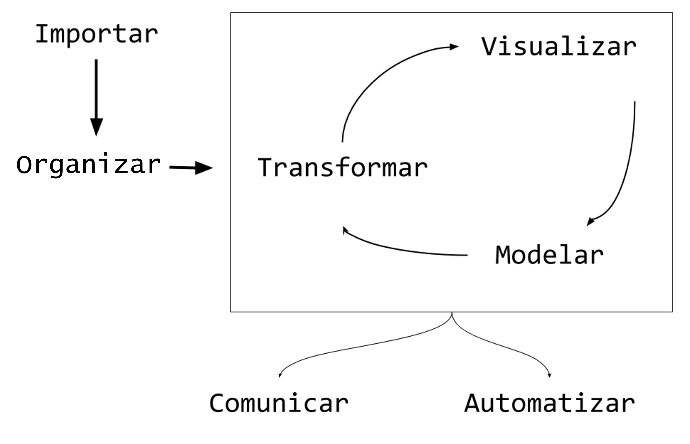{#fig-cdd-cap2 width="70%"}

Este ciclo pressupõe que as etapas anteriores foram executadas com rigor, pois (*não custa frisar*) a melhor análise estatística não corrige uma coleta de dados mal delineada. Dito isto, a maneira como o instrumento de coleta foi desenhado e o modo como os dados coletados foram organizados determinam dois aspectos importantes que entenderemos na próxima seção.

## Tipologia dos Dados

Há dois aspectos relevantes a se entender quando nos deparamos com os dados que estão prontos para análise (@fig-tipologia_dados). A rigor, estes aspectos dependem das características do fenômeno estudado e dos objetivos da pesquisa, sendo estabelecidos ainda no planejamento da coleta. O primeiro deles diz respeito à **escala de mensuração** de cada uma das colunas da tabela de dados e o segundo refere-se à **natureza** ou **estrutura destas tabelas** como um todo.

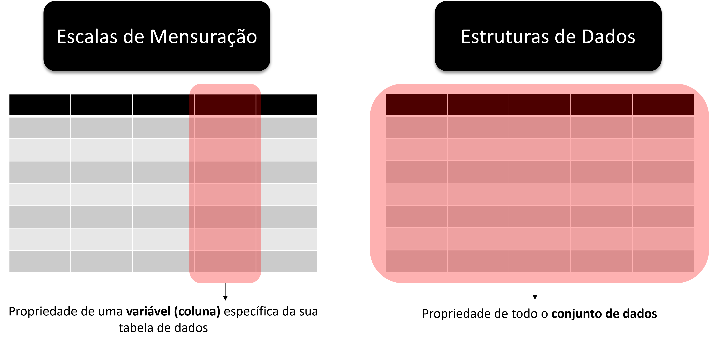{#fig-tipologia_dados}

A escala das variáveis determina quais estatísticas descritivas são válidas, além de quais testes de hipóteses e modelos estatísticos são adequados para o seu estudo. Não é possível, por exemplo, calcular **média** ou **mediana** de uma variável do tipo categórica nominal. Do ponto de vista das características da tabela de dados, é particularmente importante entender se uma mesma observação (*ex.: indivíduo, domicílio, veículo*) aparece mais de uma vez na tabela, sobretudo porque foram medidos em períodos diferentes no processo de coleta.

### Escalas de Mensuração

A classificação das escalas de mensuração mais difundida organiza as variáveis em quatro tipos [@stevens1946]. As duas primeiras, **razão** e **intervalar**, são escalas do tipo **numérica**, ao passo que as duas últimas, **ordinal** e **nominal**, são escalas especificadas como **categóricas** (@fig-escalas_dados).

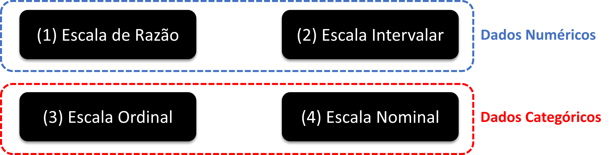{#fig-escalas_dados}

A distinção entre os quatro tipos se dá respondendo a três perguntas, em sequência:

1. Uma medida pode ser comparada à outra em termos de **ordem**?
2. A **diferença** numérica (subtração) entre duas medidas faz sentido?
3. A **razão** numérica (divisão) entre duas medidas faz sentido?

- **Escala de Razão:** o tipo mais completo de variável *numérica*. Possui zero absoluto, que representa "ausência" do atributo mensurado, o que torna as três operações válidas:
  1. [**Sim**]{style="color: #398E35;"}, é possível dizer que um valor é maior que o outro.
  2. [**Sim**]{style="color: #398E35;"}, a diferença entre dois valores é interpretável.
  3. [**Sim**]{style="color: #398E35;"}, a razão entre dois valores é interpretável.

*Exemplos:* volume de tráfego (veículos/hora); distância percorrida (km), tempo de viagem (minutos), velocidade média (km/h), número de acidentes e emissão de CO₂ (g/km). No caso de distância, por exemplo, podemos dizer que 45 km/h é maior que 30 km/h, que há uma diferença de 15 km/h entre essas duas medidas e que uma é 1,5 vezes maior que a outra.

- **Escala Intervalar:** variável *numérica* em que o zero é arbitrário (não representa "ausência" da propriedade mensurada). Por isso, diferenças são interpretáveis, mas razões não:
  1. [**Sim**]{style="color: #398E35;"}, é possível dizer que um valor é maior que o outro.
  2. [**Sim**]{style="color: #398E35;"}, a diferença entre dois valores é interpretável.
  3. [**Não**]{style="color: #D71A1E;"} é possível calcular uma razão numérica entre dois valores.

*Exemplo:* temperatura do pavimento em graus Celsius. Perceba que, neste caso, podemos dizer que 30°C é maior que 20°C e que a diferença entre ambas é de 10°C. Porém, não se pode afirmar que 30°C é "uma vez e meia" maior que 20°C, pois o zero da escala Celsius é arbitrário (não significa a ausência do atributo "temperatura", é somente o valor que atribuímos ao ponto em que a água passa do estado sólido para o líquido).

- **Escala Ordinal:** variável *categórica* em que os níveis têm uma ordem natural, mas nenhuma operação matemática de subtração ou divisão é possível de realizar entre valores diferentes:
  1. [**Sim**]{style="color: #398E35;"}, é possível dizer que um valor é maior que o outro
  2. [**Não**]{style="color: #D71A1E;"} faz sentido calcular diferenças numéricas entre dois valores.
  3. [**Não**]{style="color: #D71A1E;"} é possível calcular uma razão numérica entre dois valores.

*Exemplos:* Nível de Serviço de vias (A a F, conforme o [*Highway Capacity Manual*](https://www.trb.org/Main/Blurbs/175169.aspx)); satisfação do usuário com o transporte público (variando, por exemplo, entre *muito insatisfeito*, *insatisfeito*, *neutro*, *satisfeito* e *muito satisfeito*); nível de instrução (*ensino fundamental*, *ensino médio* e *ensino superior*, por exemplo). Com relação ao Nível de Serviço, sabemos que A é maior que B, mas não podemos atribuir um valor numérico à diferença ou à razão entre eles.

- **Escala Nominal:** variável *categórica* em que os níveis são apenas rótulos, sem qualquer ordem entre eles. Códigos numéricos eventualmente atribuídos (ex: 1 = carro, 2 = ônibus) são meros identificadores, sem significado aritmético:
  1. [**Não**]{style="color: #D71A1E;"} é possível dizer que um valor é maior que o outro.
  2. [**Não**]{style="color: #D71A1E;"} faz sentido calcular diferenças numéricas entre dois valores.
  3. [**Não**]{style="color: #D71A1E;"} é possível calcular uma razão numérica entre dois valores.

*Exemplos:* modo de transporte utilizado na viagem (carro, ônibus, metrô, a pé, bicicleta); tipo de via (arterial, coletora, local). Dizer que "bicicleta é maior que *ride-hailing*^[mobilidade por aplicativo]", "ônibus − carro = 1" ou que "metrô é três vezes carro" não tem qualquer interpretação válida.

:::{.callout-tip}
## Exercício: qual a escala dos dados abaixo?

| ID | Sexo | Qtd carros em casa | Distância de viagem | Tempo de Viagem | Horário da Viagem |
|----|:----:|:------------------:|:-------------------:|:---------------:|:-----------------:|
| 1  | M    | 0                  | 2 km                | Até 10 minutos         | 07:30 |
| 2  | F    | 0                  | 1,5 km              | Entre 31 min e 1 hora  | 08:00 |
| 3  | M    | 1                  | 3 km                | Mais de 1 hora         | 13:10 |
| 4  | M    | 2                  | 10 km               | Entre 11 e 30 minutos  | 09:20 |
| 5  | F    | 0                  | 20 km               | Entre 11 e 30 minutos  | 07:00 |
| 6  | M    | 3                  | 0,5 km              | Mais de 1 hora         | 05:30 |
| 7  | F    | 1                  | 0,1 km              | Até 10 minutos         | 06:40 |

:::

:::{.callout-tip collapse="true"}
## Resposta

|  | Sexo | Qtd carros em casa | Distância de viagem | Tempo de Viagem | Horário da Viagem |
|--|:----:|:------------------:|:-------------------:|:---------------:|:-----------------:|
|  | [**Nominal**]{style="color: #D71A1E;"} | [**Razão**]{style="color: #D71A1E;"} | [**Razão**]{style="color: #D71A1E;"} | [**Ordinal**]{style="color: #D71A1E;"} | [**Intervalar**]{style="color: #D71A1E;"} |

> Notem que **Tempo de Viagem** parece ser uma variável numérica, mas na verdade foi medida em uma escala ordinal. Para tirar a dúvida, sempre faça as 3 perguntas para checar se faz sentido as comparações. Além disso, veja que 00:00 consiste apenas em uma convenção humana para a virada do dia, não necessariamente é a ausência do atributo **Horário de Viagem**.


:::

:::{.callout-note}
## Uma outra classificação para variáveis em escala numérica

Para variáveis numéricas (razão e intervalar), existe ainda uma segunda classificação, independente da escala, que diz respeito à natureza dos valores que a variável pode assumir:

- **Contínua:** assume valores **racionais** ($\mathbb{Q}$) ou **reais** ($\mathbb{R}$), ou seja, pode tomar qualquer valor dentro de um intervalo, incluindo decimais. *Exemplos em transportes:* distância de viagem (1,35 km), velocidade média (47,8 km/h), renda domiciliar (R$ 2.795,30).

- **Discreta:** assume valores **naturais** ($\mathbb{N}$) ou **inteiros** ($\mathbb{Z}$), ou seja, valores *contáveis* ou *enumeráveis*, sem frações intermediárias com significado. *Exemplos em transportes:* quantidade de veículos na residência (0, 1, 2, 3, ...), número de viagens realizadas no dia, número de faixas de uma via.

Guarde essa classificação em mente, pois ela será muito útil quando tratarmos mais adiante de **variáveis aleatórias** e das distribuições de probabilidade associadas a cada tipo.
:::


### Tipos de estruturas de conjuntos de dados

Além da escala de mensuração das variáveis individuais, a forma como as observações são organizadas no tempo define a **estrutura do conjunto de dados**. Existem outros tipos além dos que serão apresentados aqui, mas os três mais comuns em pesquisas de transportes são o corte transversal, a série temporal e os dados em painel. É importante reconhecer a estrutura dos dados com os quais se está trabalhando, pois cada tipo implica decisões de análise e modelagem distintas. A maior parte deste livro se dedica ao primeiro caso, o corte transversal, que é também o mais frequente na prática.

**Corte transversal (*cross-section*):** medição de atributos para várias unidades em um determinado momento no tempo. Cada linha da tabela representa uma unidade observacional diferente (um indivíduo, domicílio, veículo ou via), e as colunas representam os atributos medidos.

| ID | Posse de veículo | Tamanho da família | Distância de viagem (km) | Tempo de viagem (min) |
|----|:----------------:|:------------------:|:------------------------:|:---------------------:|
| 1  | N                | 5 ou mais          | 10,00                    | 66                    |
| 2  | N                | 1                  | 10,33                    | 70                    |
| 3  | N                | 5 ou mais          | 18,84                    | 141                   |
| 4  | N                | 4                  | 22,69                    | 151                   |
| 5  | N                | 4                  | 14,53                    | 94                    |
| 6  | N                | 3                  | 15,93                    | 92                    |
| 7  | N                | 4                  | 7,49                     | 57                    |

: Exemplo de dados em corte transversal: viagens ao trabalho por domicílio (cada linha é um domicílio diferente) {#tbl-crosssection}

**Série temporal (*time series*):** dados de um atributo que varia no tempo para uma ou mais unidades em observação, com muitas repetições no tempo. Com uma quantidade de informações suficiente, torna-se possível modelar padrões intrinsecamente temporais, como sazonalidade e tendências de longo prazo. Esse tipo de dado também exige técnicas específicas que levam em conta a influência entre observações consecutivas (autocorrelação). Observe o exemplo abaixo de uma série temporal de um atributo (*decolagem*) para uma única unidade (*Aeroporto de Salvador*) ao longo de vários períodos (*meses*):

| Mês/Ano  | Decolagens (Aeroporto de Salvador-BA) |
|:--------:|:----------------------------------:|
| Jan/2022 | 3.241                              |
| Fev/2022 | 2.987                              |
| Mar/2022 | 3.512                              |
| Abr/2022 | 3.388                              |
| Mai/2022 | 3.601                              |
| Jun/2022 | 3.490                              |
| Jul/2022 | 3.658                              |
| Ago/2022 | 3.724                              |
| Set/2022 | 3.491                              |
| Out/2022 | 3.406                              |
| Nov/2022 | 3.579                              |
| Dez/2022 | 3.847                              |

: Exemplo de série temporal: quantidade mensal de decolagens no Aeroporto de Salvador (dados ilustrativos) {#tbl-timeseries}

**Dados em painel (*panel data* ou *longitudinal data*):** consiste na combinação das duas estruturas anteriores, com atributos de várias unidades observadas em múltiplos períodos. O valor analítico do painel está na possibilidade de controlar diferenças entre unidades e isolar o efeito de variáveis de interesse ao longo do tempo. No exemplo abaixo, observe que há medições de dois atributos (*decolagens* e *passageiros*) para três unidades (*aeroportos*) em dois períodos de tempo (*anos*).

| Aeroporto | Ano  | Decolagens | Passageiros |
|-----------|:----:|:----------:|:-----------:|
| Salvador  | 2021 | 38.512     | 4.201.330   |
| Salvador  | 2022 | 41.234     | 4.589.210   |
| Recife    | 2021 | 29.874     | 3.102.450   |
| Recife    | 2022 | 32.198     | 3.487.620   |
| Fortaleza | 2021 | 33.641     | 3.654.890   |
| Fortaleza | 2022 | 36.005     | 3.912.340   |

: Exemplo de dados em painel no formato *long*: desempenho anual de aeroportos do Nordeste (dados ilustrativos) {#tbl-panel-long}

Os dados em painel podem ser visualizados em dois formatos. No formato ***long*** (comprido), cada combinação unidade-período ocupa uma linha, com uma coluna indicando a unidade e outra indicando o período, conforme a @tbl-panel-long acima. No formato ***wide*** (largo), cada período ocupa uma coluna separada e cada linha representa uma unidade, com os atributos de todos os períodos dispostos lado a lado, conforme a @tbl-panel-wide abaixo. Observe que os dados são os mesmos da anterior (@tbl-panel-long), somente dispostos de uma maneira diferente.

| Aeroporto | Decolagens 2021 | Decolagens 2022 | Passageiros 2021 | Passageiros 2022 |
|-----------|:---------------:|:---------------:|:----------------:|:----------------:|
| Salvador  | 38.512          | 41.234          | 4.201.330        | 4.589.210        |
| Recife    | 29.874          | 32.198          | 3.102.450        | 3.487.620        |
| Fortaleza | 33.641          | 36.005          | 3.654.890        | 3.912.340        |

: Os mesmos dados em painel no formato *wide* {#tbl-panel-wide}

<!--O formato *long* é o mais conveniente para análise no R com o tidyverse, e a transformação entre os dois formatos é tratada no [Capítulo 4](4manipulacao-de-dados.qmd) com as funções `pivot_longer()` e `pivot_wider()` do pacote **tidyr**.-->

:::{.callout-note}
## Série temporal ou dados em painel?

À primeira vista, os dois tipos parecem estruturalmente similares, pois ambos combinam observações ao longo do tempo. A diferença fundamental está na *assimetria* entre as duas dimensões e no objetivo analítico de cada estrutura.

Numa **série temporal**, o número de períodos costuma ser grande (centenas ou milhares de observações) e o número de unidades é pequeno. O foco analítico recai sobre a dinâmica temporal: autocorrelação, tendência, sazonalidade e estacionariedade são os conceitos centrais.

Nos **dados em painel**, a lógica é inversa: é comum haver muitas unidades e o número de períodos é pequeno ou moderado. O valor central do painel não está na abundância de períodos, mas na possibilidade de controlar as **diferenças entre unidades** que afetam a variável de interesse mas não variam no tempo e não são diretamente mensuráveis [@wooldridge2010]. Essa capacidade de separar os efeitos transversais dos temporais é a principal vantagem estrutural dos dados longitudinais em relação ao corte transversal isolado e à série temporal pura.

Em transportes, considere um painel de municípios com dados anuais de acidentalidade viária ao longo de 5 anos. O painel permite isolar o efeito de políticas de segurança viária, isolando características municipais permanentes (topografia e estrutura da rede viária), algo impossível tanto num corte transversal quanto numa série temporal de um único município.
:::

## Noções de Amostragem {#sec-amostragem}

Raramente é possível ou desejável observar todos os elementos de uma população de interesse. Para tanto, os **procedimentos amostrais** oferecem um caminho para obter informações confiáveis sobre a população a partir de um subconjunto menor de observações, uma vez que esse subconjunto seja selecionado de forma adequada. Nesta seção, abordaremos alguns aspectos introdutórios sobre amostragem, mas sem o aprofundamento robusto que o tema requer^[De fato, existem disciplinas e livros inteiros dedicados somente a este tópico!]. Para tanto, precisaríamos de um suporte teórico maior sobre teoria da probabilidade que só veremos mais adiante. Entretanto, essa aproximação inicial é fundamental para entendermos este que é um dos principais desafios de uma pesquisa empírica.

### Conceitos Fundamentais

Imagine que você precisa estimar o tempo médio que os trabalhadores brasileiros gastam se deslocando ao trabalho. A resposta exata existe em algum lugar, mas para calculá-la com certeza, você precisaria perguntar a cada trabalhador brasileiro. Esse conjunto de todos os elementos sobre os quais queremos fazer afirmações é o que chamamos de **população**. Como observar toda a população raramente é viável, a solução é selecionar um subconjunto menor e bem escolhido, aquilo que denominamos de **amostra**. Cada elemento individual que pode ser observado desta amostra, por sua vez (um trabalhador, neste caso), é o que denominamos **unidade amostral**.

A @fig-pop_amostra resume esse movimento central da pesquisa empírica, onde observamos a amostra e, a partir dela, fazemos **inferências** sobre a população.

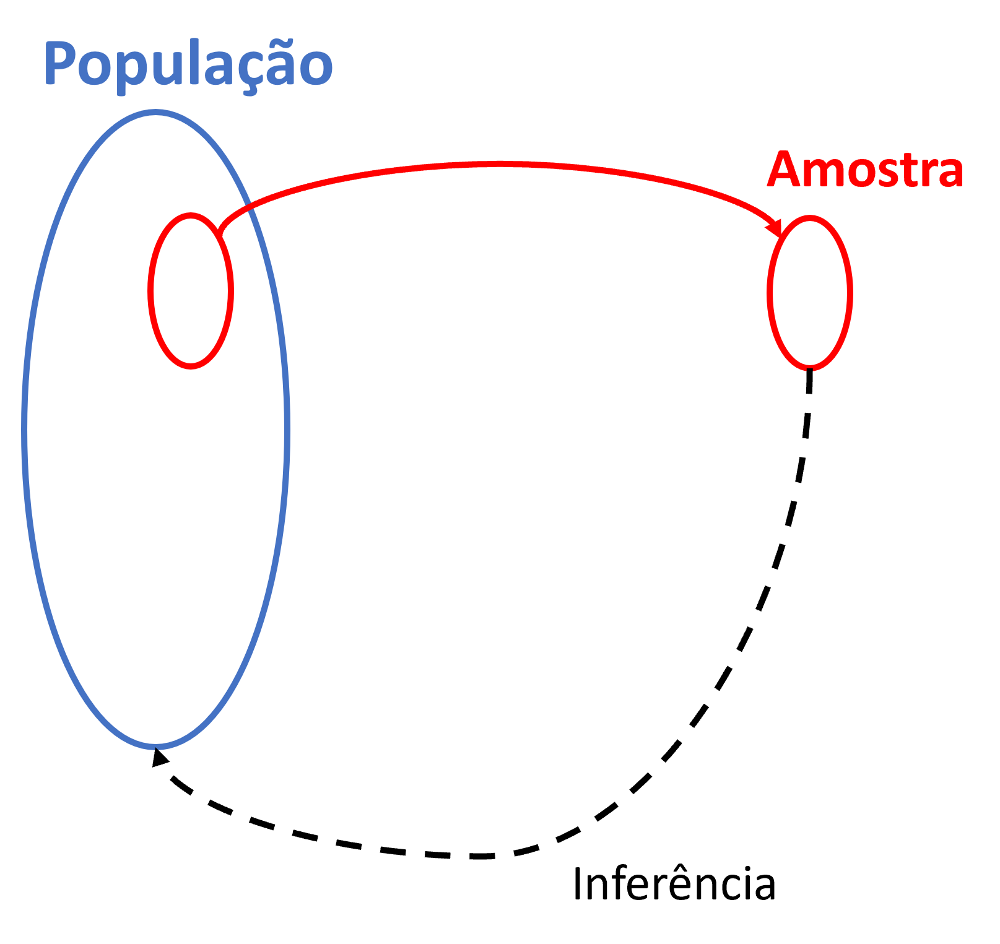{#fig-pop_amostra width="60%"}

Outros conceitos importantes são o de **parâmetro**, **estimativa** e **erro amostral**. Enquanto **parâmetro** diz respeito a uma estatística que calculamos sobre os dados de toda a população, **estimativa** refere-se a essa estatística computada em uma amostra. Considerando o exemplo anterior, estamos falando da média do tempo de viagem, que difere somente sobre qual base de dados é calculada (população ou amostra). A diferença entre essa estimativa e o parâmetro verdadeiro é o chamamos de **erro amostral**. Ele sempre existe em alguma medida, simplesmente porque a amostra não é a população inteira.

Para tornar esses conceitos concretos, suponha que o Censo Demográfico, ao observar toda a população brasileira, revele que o tempo médio de viagem ao trabalho é de 55 minutos (**parâmetro**), ao passo que a PNAD Contínua, ao levantar apenas uma amostra, estima esse mesmo valor em 51 minutos (**estimativa**). Neste caso, a diferença de 4 minutos entre os dois é o **erro amostral** da estimativa.

Do ponto de vista da qualidade da amostra, há dois atributos ainda a serem considerados. O primeiro deles é a **precisão** (*precision*), que diz respeito ao quão concentrados estão os valores observados em torno da estimativa. A segunda é a **exatidão**, também chamada de *acurácia* (do inglês *accuracy*), que se refere ao quão próxima a estimativa está do parâmetro verdadeiro da população. É possível ser muito preciso sem ser exato (resultados consistentes entre si, mas sistematicamente afastados da realidade) e ser exato sem ser muito preciso (resultados que oscilam em torno do valor correto, mas sem grande consistência entre si).

Associado a cada um desses atributos, há um tipo específico de erro. A falta de precisão é consequência do **erro aleatório**, a variabilidade natural que decorre do fato de observarmos apenas uma parcela da população, que pode ser substancialmente reduzido com amostras maiores. A falta de exatidão, por sua vez, é consequência do **erro sistemático** (o **viés**), um desvio consistente e em sentido fixo entre a estimativa e o parâmetro verdadeiro. O viés não se cancela com amostras maiores, pois na continuidade do fator de enviesamento, o desvio permanece. Uma pesquisa que não entrevista moradores em regiões de favelas, por exemplo, sistematicamente sub-representa domicílios de renda mais baixa, independentemente de quantas entrevistas sejam feitas.

O erro amostral observado em cada pesquisa resulta, na verdade, da combinação dessas duas componentes (erro aleatório e erro sistemático). Suponha que, conhecendo o parâmetro verdadeiro do tempo médio de viagem ao trabalho (55 minutos), você realize diversas pesquisas amostrais independentes e calcule o erro em cada uma (estimativa − parâmetro). Se os erros oscilarem sem direção preferida (ora +3 min, ora −2 min, ora +5 min, ...), você está diante de um erro predominantemente aleatório. A estimativa flutua em torno do parâmetro e tende a se anular em média, sem falhas sistemáticas no processo de coleta. 

Se, em vez disso, os erros forem consistentemente positivos (ora +10 min, ora + 5 min, ora + 7 min, por exemplo), você está diante de uma componente sistemática. Alguma característica do processo de coleta empurra as estimativas persistentemente acima do parâmetro verdadeiro, e aumentar o tamanho da amostra não resolverá o problema.

Para visualizar essa distinção, pense em cada ponto da @fig-exat-prec1 abaixo como um valor observado de um atributo qualquer obtido de cada elemento da amostra. O centro do alvo representa o parâmetro verdadeiro da população. Observe os quatro casos e reflita: em quais temos o pior e melhor situação de precisão e exatidão? E por quê?

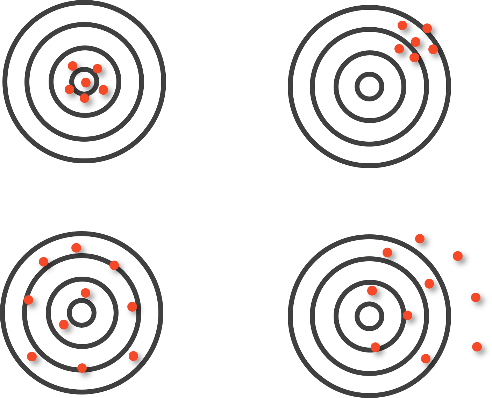{#fig-exat-prec1 width="70%"}

:::{.callout-tip collapse="true"}
## Resposta

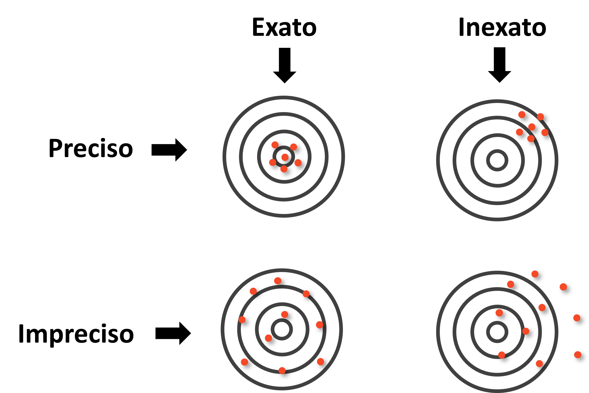{#fig-exat-prec1-rotulos}

O painel superior esquerdo, **preciso e exato**, é o cenário ideal: os erros são pequenos e aleatórios, sem direção preferida. O painel inferior esquerdo, **impreciso mas exato**, não aparenta ter viés, mas são grandes: os valores variam bastante, mas em média se centram no parâmetro. O painel superior direito, **preciso mas inexato**, é o mais enganoso: o erro é predominantemente sistemático, pois os valores são consistentes entre si, mas apontam coletivamente para o lugar errado. O painel inferior direito, **impreciso e inexato**, combina os dois problemas.
:::

Há uma complicação da realidade, porém, que muda tudo. Na prática, quase nunca sabemos onde fica o centro do alvo, pois o motivo de realizarmos uma amostragem é exatamente entender algo que desconhecemos sobre a população. De fato, caso soubéssemos o parâmetro verdadeiro, não haveria qualquer motivo para conduzir uma pesquisa amostral. A @fig-exat-prec2 reproduz os quatro painéis anteriores sem o centro do alvo visível, situação análoga à da pesquisa real.

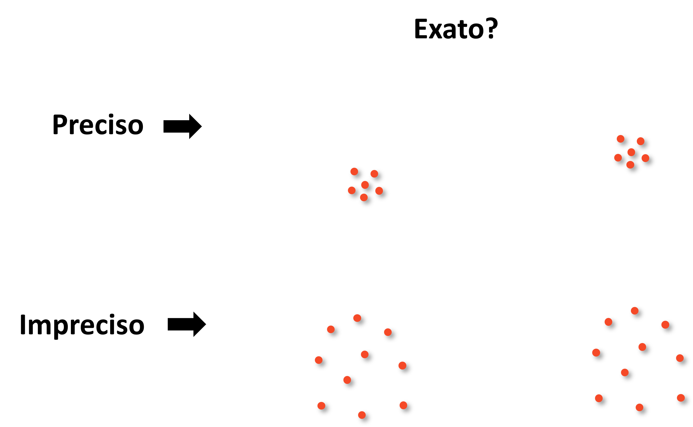{#fig-exat-prec2}

Sem o centro do alvo, os dois painéis da coluna esquerda (um exato e um inexato) ficam indistinguíveis à primeira vista. Essa situação revela uma assimetria fundamental entre os dois tipos de erro, discutida em detalhe por @richardson1995. O **erro aleatório** pode ser estimado a partir dos próprios dados da amostra, pois é uma expressão direta da dispersão dos valores observados em torno da estimativa. Esse cálculo está no coração das fórmulas de dimensionamento amostral e dos intervalos de confiança que veremos mais adiante. O **erro sistemático**, por outro lado, é invisível para quem olha apenas para dentro da amostra. Se todos os respondentes foram selecionados de forma tendenciosa, os dados internos nada revelarão sobre o desvio em relação à população real.

:::{.callout-note}
Essa assimetria cria uma armadilha recorrente. Como o erro aleatório é visível e quantificável, recebe atenção e recursos, pois basta aumentar o tamanho da amostra. Como o viés é invisível sem referência externa, tende a ser ignorado. Nas palavras de @richardson1995, o resultado é o risco de gastar recursos para obter respostas **precisamente erradas**. Em pesquisas de transportes, um exemplo claro é uma contagem de tráfego realizada apenas em dias úteis de bom tempo: a grande quantidade de dados produz estimativas muito precisas de volumes que, no entanto, ignoram sistematicamente a variação por dia da semana e condições climáticas, gerando um retrato fiel de uma condição que não representa o comportamento médio real.
:::

### Métodos de Amostragem

Compreendidas as propriedades que definem uma boa amostra e os tipos de erro que podem comprometê-la, o próximo passo é entender como os elementos são efetivamente selecionados da população. A escolha do método de amostragem não é uma decisão trivial, pois condiciona a qualidade das estimativas produzidas, os recursos necessários para a coleta e a capacidade de generalização dos resultados. Para navegar por esse conjunto de opções, é útil organizá-las segundo três eixos de classificação complementares:

**(A) Probabilístico vs. não-probabilístico:** o critério mais fundamental, que separa os métodos em que cada elemento tem uma probabilidade conhecida e não nula de integrar a amostra daqueles em que a seleção depende de julgamento, conveniência ou acaso não controlado. Apenas os métodos probabilísticos permitem calcular formalmente o erro amostral e fazer inferências generalizáveis sobre a população.

**(B) Único estágio vs. múltiplos estágios:** nos métodos de estágio único, os elementos da amostra são selecionados diretamente da população em uma única operação de sorteio. Nos métodos de múltiplos estágios, a seleção ocorre em etapas hierárquicas, sorteando-se primeiro unidades maiores (setores, zonas, municípios) e, dentro das unidades selecionadas, as unidades menores de interesse (domicílios e indivíduos). 

**(C) Seleção equiprovável vs. não-equiprovável:** nos métodos equiprováveis, todos os elementos da população têm a mesma probabilidade de ser incluídos na amostra. Nos métodos não-equiprováveis, as probabilidades de seleção variam intencionalmente entre subgrupos (o que pode ser justificado por razões analíticas, como garantir representação de grupos minoritários, ou por razões operacionais).

#### Amostragem Não Probabilística

Nesses métodos, a seleção dos elementos não segue um processo aleatório definido, o que impede o cálculo rigoroso do erro amostral e compromete a generalização dos resultados. São exemplos:

- **Amostragem por conveniência:** aquelas em que comumente se selecionam os elementos mais fáceis de acessar. Por exemplo, entrevistar passageiros na saída de uma estação de metrô à qual o pesquisador tem acesso ou distribuir questionários *online* por meio de redes sociais configuram amostragem por conveniência. É rápida e barata, mas altamente sujeita a viés de seleção^[erro sistemático que ocorre quando a amostra de um estudo não representa adequadamente a população-alvo devido à forma como os participantes são selecionados].
- **Amostragem intencional (ou por julgamento):** o pesquisador seleciona deliberadamente elementos considerados representativos ou informativos (por exemplo, escolher municípios "típicos" de diferentes regiões do país para um estudo de caso). Requer conhecimento prévio aprofundado e é difícil de justificar formalmente.

Esses métodos são aceitáveis em estudos exploratórios, pesquisas qualitativas e situações com severas restrições operacionais, mas não devem ser utilizados quando se pretende fazer inferências estatísticas sobre a população.

#### Amostragem Probabilística

Nesses métodos, cada elemento da população tem uma probabilidade conhecida e diferente de zero de ser incluído na amostra. Essa propriedade é o que permite calcular o erro amostral e construir intervalos de confiança, tornando os resultados generalizáveis à população-alvo.

Para que um método probabilístico funcione na prática, é necessário definir o **quadro amostral** (*sampling frame*), a lista operacional ou dispositivo a partir do qual os elementos serão efetivamente selecionados. Enquanto a população-alvo é um conceito teórico, o quadro amostral é a sua materialização prática. Exemplos típicos em transportes incluem cadastros de domicílios, listas de placas de veículos e relações de domicílios de empresas de distribuição de água/energia.

A @fig-pop-frame ilustra a relação entre população-alvo, quadro amostral e amostra. Em situação ideal, os dois primeiros coincidiriam perfeitamente. Na prática, o quadro amostral raramente cobre a população-alvo sem lacunas ou excessos, gerando dois tipos de discrepância:

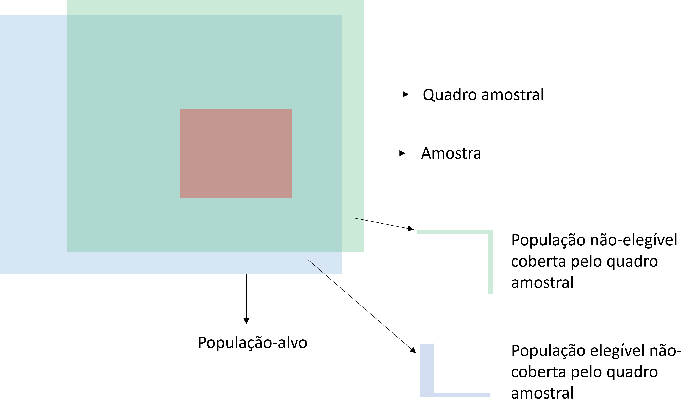{#fig-pop-frame width="70%"}

- **População não-elegível coberta pelo quadro amostral:** elementos presentes no quadro que *não* pertencem à população-alvo. Em uma pesquisa domiciliar de usuários do transporte público, um cadastro que inclui imóveis comerciais e domicílios desocupados exemplifica esse caso: sortear um imóvel comercial resulta em uma tentativa de entrevista inválida.

- **População elegível não-coberta pelo quadro amostral:** elementos que pertencem à população-alvo mas estão ausentes do quadro. É a situação de *cobertura incompleta* (*undercoverage*), potencialmente a mais grave: esses elementos nunca terão chance de ser selecionados, o que pode introduzir viés sistemático quando o grupo não-coberto difere do restante em aspectos relevantes para a pesquisa. Uma pesquisa domiciliar baseada em listas telefônicas, por exemplo, excluiria sistematicamente domicílios sem telefone fixo.

Com o quadro amostral adequado em mãos, a seleção propriamente dita pode seguir diferentes estratégias:

**Amostragem Aleatória Simples:** cada elemento da população tem a mesma probabilidade de ser selecionado. A seleção é feita por sorteio, geralmente sem reposição. É o método mais simples e serve de base para a derivação das fórmulas de dimensionamento amostral. Em transportes, seria equivalente a selecionar aleatoriamente domicílios a partir de um cadastro completo de endereços para realizar uma pesquisa Origem-Destino (OD).

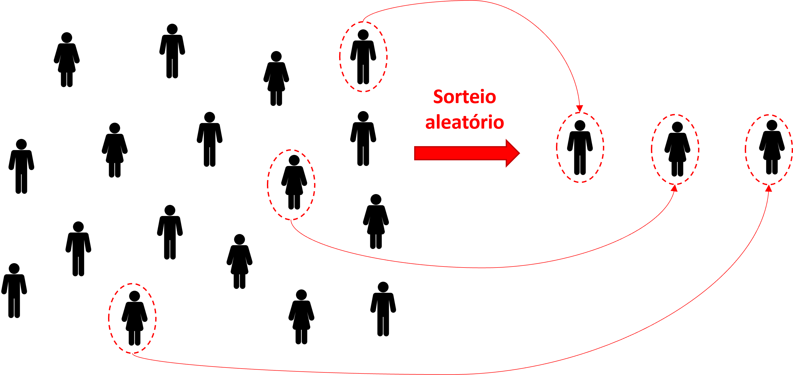{#fig-aas width="80%"}

**Amostragem Aleatória Sistemática:** os elementos são ordenados (por endereço, número de cadastro, posição na fila) e selecionados a cada intervalo fixo $k$ (por exemplo, a cada 10 domicílios). É operacionalmente mais simples que a amostragem aleatória simples quando existe uma listagem ordenada e produz resultados similares desde que a ordem de listagem não esteja correlacionada com atributos importantes que se deseja mensurar.

**Amostragem Aleatória Estratificada:** a população é dividida em subgrupos homogêneos internamente (*estratos*) e uma amostra probabilística é retirada de cada estrato. É especialmente útil quando se quer garantir representação adequada de grupos minoritários ou quando a variabilidade entre estratos é maior que dentro deles.

*Exemplo:* numa pesquisa de satisfação com o transporte público, estratificar por modo (metrô, trem metropolitano, ônibus municipal, ônibus interurbano) garante que usuários de metrô não dominem a amostra pelo volume e que modos de menor frequência sejam adequadamente representados.

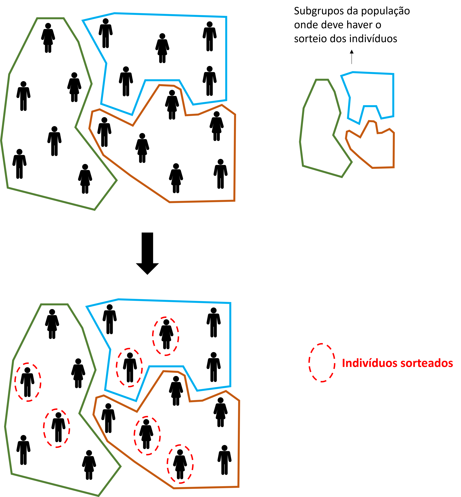{#fig-aae width="80%"}

**Amostragem por Conglomerados:** a população é dividida em grupos (**conglomerados** ou ***clusters***) que funcionam como unidades de amostragem, e uma amostra desses grupos é sorteada. Dentro dos conglomerados sorteados, todos os elementos (ou uma subamostra deles) são pesquisados. É especialmente indicada quando a população é geograficamente dispersa, os custos de deslocamento são elevados ou não existe cadastro individual de boa qualidade. Ao contrário dos estratos, os conglomerados devem ser internamente heterogêneos, cada um representando a diversidade da população, e externamente homogêneos entre si.

*Exemplo:* numa pesquisa sobre mobilidade *intercampi* com estudantes de uma universidade, sorteiam-se os cursos e, dentro de cada curso, obtém-se resposta de todos (ou quase todos) os alunos.

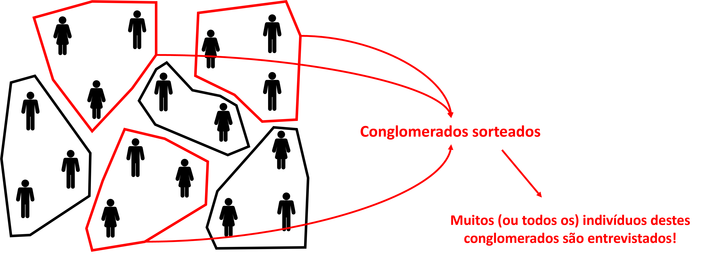{#fig-apc width="80%"}

:::{.callout-note}
## Estratificada vs. Conglomerados: a inversão da homogeneidade

À primeira vista, amostragem estratificada e amostragem por conglomerados parecem semelhantes, pois ambas dividem a população em grupos antes de sortear. A diferença fundamental está na lógica oposta de formação desses grupos:

| | Dentro do grupo | Entre grupos |
|---|:---:|:---:|
| **Estratificada** (estratos) | Homogêneo | Heterogêneo |
| **Conglomerados** (*clusters*) | Heterogêneo | Homogêneo |

Na amostragem estratificada, o objetivo é formar grupos internamente homogêneos, de modo que a variância dentro de cada estrato seja pequena. Observações adicionais dentro do mesmo estrato tendem a agregar pouca informação nova, o que justifica sortear apenas uma amostra dentro de cada estrato, sem necessidade de pesquisar todos os seus elementos.

Na amostragem por conglomerados, a lógica é inversa. O ideal é que cada conglomerado seja uma miniatura heterogênea da população inteira, de modo que qualquer conglomerado sorteado seja igualmente representativo. Os conglomerados entre si devem ser parecidos (homogêneos), o que justifica pesquisar poucos deles com maior profundidade, concentrando o trabalho de campo.

Na prática, porém, conglomerados naturais como setores censitários tendem a ser internamente homogêneos por razões socioeconômicas e geográficas, violando o ideal teórico. É exatamente por isso que a amostragem por conglomerados geralmente exige amostras maiores para atingir a mesma precisão: observações dentro de um mesmo conglomerado carregam informações redundantes sobre a população.
:::

### Dimensionamento da Amostra 

Definido o método de amostragem, a pergunta seguinte é: **quantas observações são necessárias?** Esta resposta é condicionada por diversos aspectos, mas sobretudo pelo método de amostragem escolhido. Nesta seção, apresentaremos o caso mais trivial, considerando uma **amostragem aleatória simples** para uma variável de proporção (ex.: proporção de indivíduos que usam o transporte motorizado individual). Neste caso, precisamos entender três fatores fundamentais, ilustrados na @fig-dim-amostra:

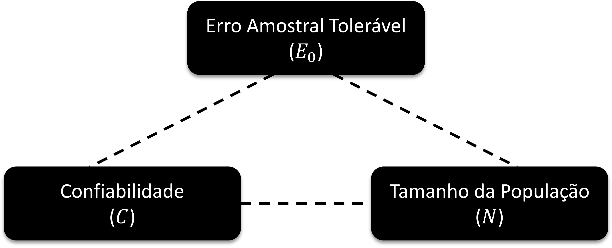{#fig-dim-amostra width="80%"}

- **Erro amostral tolerável ($E_0$):** o desvio máximo aceitável entre a estimativa amostral e o parâmetro populacional verdadeiro. Quanto menor o erro tolerável, maior a amostra exigida. Trata-se de uma decisão do pesquisador, condicionada pelos objetivos da pesquisa.
- **Confiabilidade ($C$):** a frequência com que, em amostras repetidas, o intervalo $\text{estimativa} \pm E_0$ (também denominado **intervalo de confiança**) conteria o parâmetro verdadeiro da população. Um nível de 95% não é uma afirmação sobre uma amostra específica, mas sobre o método. Neste caso, se o procedimento fosse repetido muitas vezes, 95% desses intervalos conteriam o verdadeiro valor do parâmetro. Níveis mais elevados (por exemplo, 99%) exigem amostras maiores para o mesmo $E_0$ (ou tolerar $E_0$ maiores para um mesmo tamanho de amostra).
- **Tamanho da população ($N$):** o número de elementos da população-alvo. Para populações muito grandes, o tamanho de amostra necessário converge para um valor fixo e passa a ser praticamente independente de $N$. Isso tem uma implicação prática importante, pois uma pesquisa em uma cidade com 5 milhões de habitantes não exige uma amostra muito maior do que em outra cidade com 500 mil.

Sendo assim, podemos empregar uma fórmula simplificada^[esta fórmula é na verdade uma aproximação da formulação original, que veremos melhor [neste capítulo](14estimacao-de-parametros.qmd)] que incorpora esses três fatores com a confiabilidade fixada em 95%:

$$n_0 = \frac{1}{E_0^2}$$ {#eq-n0}

onde $n_0$ é o tamanho de amostra para uma população ***infinitas*** e $E_0$ é o **erro amostral tolerável** (expresso em proporção, não em porcentagem). Para populações ***finitas*** de tamanho $N$, aplica-se a correção:

$$n = \frac{N \cdot n_0}{N + n_0}$$ {#eq-n-corrigido}

O resultado é o tamanho mínimo de amostra necessário para estimar uma proporção com erro não superior a $E_0$ e confiabilidade de 95%.

*Exemplo 1:* deseja-se levantar, por amostragem aleatória simples, a proporção de pessoas que utiliza o transporte coletivo em uma cidade com 200 habitantes. Qual o tamanho mínimo de amostra para que os erros não ultrapassem 4%, a uma confiabilidade de 95%?

$$n_0 = \frac{1}{(0{,}04)^2} = 625 \quad \Rightarrow \quad n = \frac{200 \times 625}{200 + 625} \approx 152$$

*Exemplo 2:* o mesmo problema, agora para uma cidade com 200.000 habitantes:

$$n_0 = \frac{1}{(0{,}04)^2} = 625 \quad \Rightarrow \quad n = \frac{200.000 \times 625}{200.000 + 625} \approx 624$$

Os dois exemplos revelam uma propriedade fundamental da fórmula. O valor $n_0 = 625$ é idêntico nos dois casos, pois $E_0$ e $C$ são os mesmos. O que muda é o peso da correção para populações finitas. Para $N = 200$, a amostra precisa cobrir cerca de **76% da população** para atingir o erro tolerado. Para $N = 200.000$, basta entrevistar **menos de 0,4% da população**, pois $n \approx n_0$. Esse contraste é o argumento central que justifica a existência da correção para populações finitas na fórmula.

A @fig-amostra-n-vs-N ilustra o comportamento de $n$ em função de $N$ para $E_0 = 4\%$, destacando os dois exemplos. O eixo horizontal está em escala logarítmica para que ambos os pontos ($N = 200$ e $N = 200.000$) sejam visíveis. A convergência para $n_0 = 625$ ocorre rapidamente: a partir de populações de algumas dezenas de milhares, $n$ praticamente não varia com $N$.

```{r}
#| label: fig-amostra-n-vs-N
#| fig-cap: "Tamanho de amostra necessário (n) em função do tamanho da população (N) para E₀ = 4% e C = 95% (eixo horizontal em escala logarítmica). A linha tracejada indica a assíntota n₀ = 625. Os pontos vermelhos correspondem aos dois exemplos da seção."
#| warning: false
#| message: false
#| echo: false

library(tidyverse)

n0_val <- 1 / 0.04^2  # 625

dados_curva <- tibble(
  N = 10^seq(log10(100), log10(500000), by = 0.02)
) |>
  mutate(n = N * n0_val / (N + n0_val))

dados_exemplos <- tibble(
  N     = c(200, 200000),
  n     = N * n0_val / (N + n0_val),
  label = c("Exemplo 1\nN = 200, n ≈ 152", "Exemplo 2\nN = 200.000, n ≈ 624")
)

ggplot(dados_curva, aes(x = N, y = n)) +
  geom_line(linewidth = 1, color = "#2E86AB") +
  geom_hline(yintercept = n0_val, linetype = "dashed", color = "gray50") +
  geom_point(data = dados_exemplos, color = "#D62828", size = 3) +
  geom_label(
    data = dados_exemplos, aes(label = label),
    color = "#D62828", size = 3, nudge_y = -70, nudge_x = 0.15
  ) +
  annotate(
    "text", x = 200, y = n0_val + 22,
    label = expression(n[0] == 625), hjust = 1, size = 3.5, color = "gray50"
  ) +
  scale_x_log10(
    labels = scales::label_number(big.mark = ".", decimal.mark = ",")
  ) +
  scale_y_continuous(
    labels = scales::label_number(big.mark = ".", decimal.mark = ",")
  ) +
  labs(
    x = "Tamanho da população (N, escala logarítmica)",
    y = "Tamanho mínimo da amostra (n)"
  ) +
  theme_minimal()
```

## Exercícios

**1.** Uma pesquisa deseja estimar a proporção de usuários de transporte público que avaliam o serviço como "satisfatório ou muito satisfatório" em uma cidade com 800.000 habitantes adultos. Usando a fórmula de Barbetta com erro amostral de 3%, calcule o tamanho mínimo da amostra necessário.

**2.** Classifique as variáveis a seguir quanto à escala de mensuração (nominal, ordinal, intervalar ou razão) e justifique sua resposta:

   a. Número de passageiros por viagem de ônibus
   b. Avaliação da sinalização viária (ruim, regular, boa, ótima)
   c. Código numérico do modo de transporte (1 = carro, 2 = ônibus, 3 = metrô, 4 = bicicleta)
   d. Tempo de espera no ponto de ônibus (em minutos)
   e. CEP do domicílio de origem da viagem

**3.** Uma equipe de pesquisa deseja estimar a velocidade média de operação dos ônibus no corredor expresso de uma cidade. Explique por que a fórmula de Barbetta ($n_0 = 1/E_0^2$) **não** é diretamente aplicável a este caso e descreva qual informação adicional seria necessária para dimensionar a amostra corretamente.

**4.** A Secretaria de Transportes de uma cidade pretende realizar uma pesquisa de satisfação com usuários do metrô. A população de usuários é estimada em 120.000 passageiros/dia. A secretaria deseja que o erro amostral não ultrapasse 4%. Calcule:

   a. O tamanho da amostra para uma população infinita ($n_0$).
   b. O tamanho corrigido da amostra ($n$) para a população de 120.000 usuários.
   c. A diferença percentual entre $n$ e $n_0$. O que esse resultado indica sobre a influência do tamanho da população neste caso?

**5.** Classifique os planos amostrais a seguir quanto ao método de amostragem (conveniência, sistemática, estratificada, conglomerados) e identifique possíveis fontes de viés em cada caso:

   a. Entrevistar os primeiros 200 passageiros que desembarcam em uma estação de metrô durante a hora de pico da manhã.
   b. Sortear 30 setores censitários da cidade e entrevistar todos os domicílios de cada setor sorteado.
   c. Dividir os bairros em três grupos (alta, média e baixa renda) e sortear uma amostra proporcional de domicílios em cada grupo.
   d. A partir de um cadastro de veículos com placa, selecionar um veículo ao acaso entre os primeiros 10 e, a partir dele, selecionar a cada 10 veículos subsequentes.
